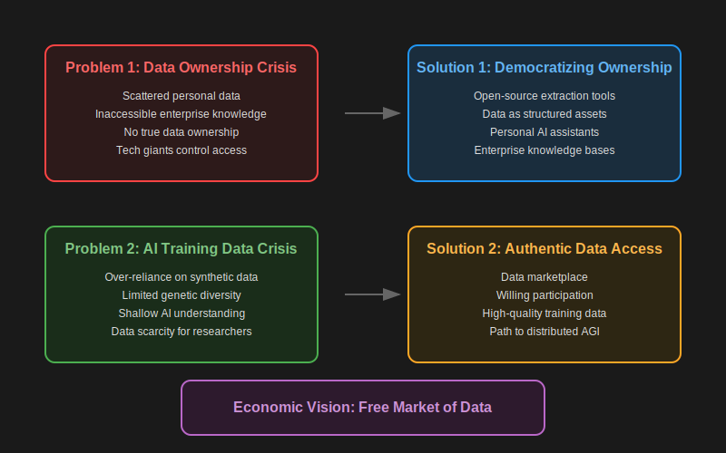

# Mission

### 1. The Data Capitalization Opportunity

We live in an unprecedented era of digital wealth creation. Every day, individuals and enterprises generate massive amounts of valuable digital footprints across various platforms, social media channels, messenger apps, and cloud services. While people can interact with their data within these platforms, there's an immense untapped opportunity to transform this data into true capital assets. Just as physical property became a foundational element of wealth creation, personal and enterprise data has the potential to become a new form of capital on balance sheets.

For individuals, this represents an opportunity to transform their digital activities into valuable assets. For enterprises, their internal communications, team discussions, and collaborative documents contain rich insights that could be structured and valued as intellectual capital. This wealth of information represents an unprecedented opportunity for value creation in the digital age.

### 2. The Potential of Authentic Data

While synthetic data has played a crucial role in AI development, there's an enormous untapped potential in the authentic data generated by individuals and organizations. Every message, document, and interaction contains unique insights and patterns that could enhance AI development. The challenge isn't a lack of data - it's that most authentic human-generated data remains inaccessible for productive use.

By enabling willing participation in data sharing, we can unlock this vast reservoir of authentic human knowledge. This represents an opportunity to enhance AI development with diverse, real-world data that reflects the full spectrum of human experience and knowledge.

## Our Pathway to Data Democracy

### 1. Open-Source Foundation

Our first step is creating an open-source data extraction engine that empowers developers and innovators to build tools for data structuring and organization. This foundation ensures transparency, security, and community-driven development. By making these tools openly available, we enable the technical infrastructure needed for true data ownership and capitalization.

### 2. Data Capitalization Platform

Building on this open-source foundation, we're developing a platform that helps individuals and enterprises transform their digital footprints into structured, valuable assets. This platform will provide the tools and frameworks needed to organize, understand, and value personal and organizational data as true capital assets.

### 3. Creating a Data Marketplace

The final piece is establishing a marketplace where individuals and organizations can willingly share their data assets. This creates opportunities for:
- Individuals to earn equity, revenue, or other forms of value from their data
- Enterprises to access diverse, high-quality data for AI development
- Researchers to work with authentic human-generated data
- Startups to build innovative solutions using real-world data

## Economic Vision: A Shared Data Economy

We envision a future where data becomes a fundamental asset class in a thriving shared economy. This transformation will democratize AI development by enabling willing participation in data sharing, ensuring that the benefits of AI advancement flow back to data creators. Just as property rights revolutionized economic systems, establishing data as a capital asset will create new opportunities for wealth creation and economic participation.

This shared data economy will:
- Enable individuals to capitalize on their digital footprints
- Create new revenue streams for data creators
- Provide AI developers with access to diverse, authentic data
- Foster innovation through broader access to real-world data
- Ensure more equitable distribution of AI's economic benefits

Our vision is to facilitate this transformation from the ground up - starting with open-source tools, progressing to data capitalization platforms, and ultimately creating a thriving marketplace where data becomes a true asset class in a shared economy. This approach ensures that the future of AI is built on a foundation of authentic human knowledge, with benefits flowing back to the individuals and organizations who create and share their valuable data.