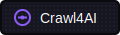
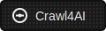

# 🚀🤖 Crawl4AI: Open-source LLM Friendly Web Crawler & Scraper.

<div align="center">

<a href="https://trendshift.io/repositories/11716" target="_blank"></a>

[](https://github.com/unclecode/crawl4ai/stargazers)
[](https://github.com/unclecode/crawl4ai/network/members)

[](https://badge.fury.io/py/crawl4ai)
[](https://pypi.org/project/crawl4ai/)
[](https://pepy.tech/project/crawl4ai)

<p align="center">
    <a href="https://x.com/crawl4ai">
      
    </a>
    <a href="https://www.linkedin.com/company/crawl4ai">
      
    </a>
    <a href="https://discord.gg/jP8KfhDhyN">
      
    </a>
  </p>
</div>

Crawl4AI is the #1 trending GitHub repository, actively maintained by a vibrant community. It delivers blazing-fast, AI-ready web crawling tailored for LLMs, AI agents, and data pipelines. Open source, flexible, and built for real-time performance, Crawl4AI empowers developers with unmatched speed, precision, and deployment ease.  

[✨ Check out latest update v0.7.0](#-recent-updates)

🎉 **Version 0.7.0 is now available!** The Adaptive Intelligence Update introduces groundbreaking features: Adaptive Crawling that learns website patterns, Virtual Scroll support for infinite pages, intelligent Link Preview with 3-layer scoring, Async URL Seeder for massive discovery, and significant performance improvements. [Read the release notes →](https://docs.crawl4ai.com/blog/release-v0.7.0)

<details>
<summary>🤓 <strong>My Personal Story</strong></summary>

My journey with computers started in childhood when my dad, a computer scientist, introduced me to an Amstrad computer. Those early days sparked a fascination with technology, leading me to pursue computer science and specialize in NLP during my postgraduate studies. It was during this time that I first delved into web crawling, building tools to help researchers organize papers and extract information from publications a challenging yet rewarding experience that honed my skills in data extraction.

Fast forward to 2023, I was working on a tool for a project and needed a crawler to convert a webpage into markdown. While exploring solutions, I found one that claimed to be open-source but required creating an account and generating an API token. Worse, it turned out to be a SaaS model charging $16, and its quality didn’t meet my standards. Frustrated, I realized this was a deeper problem. That frustration turned into turbo anger mode, and I decided to build my own solution. In just a few days, I created Crawl4AI. To my surprise, it went viral, earning thousands of GitHub stars and resonating with a global community.

I made Crawl4AI open-source for two reasons. First, it’s my way of giving back to the open-source community that has supported me throughout my career. Second, I believe data should be accessible to everyone, not locked behind paywalls or monopolized by a few. Open access to data lays the foundation for the democratization of AI, a vision where individuals can train their own models and take ownership of their information. This library is the first step in a larger journey to create the best open-source data extraction and generation tool the world has ever seen, built collaboratively by a passionate community.

Thank you to everyone who has supported this project, used it, and shared feedback. Your encouragement motivates me to dream even bigger. Join us, file issues, submit PRs, or spread the word. Together, we can build a tool that truly empowers people to access their own data and reshape the future of AI.
</details>

## 🧐 Why Crawl4AI?

1. **Built for LLMs**: Creates smart, concise Markdown optimized for RAG and fine-tuning applications.  
2. **Lightning Fast**: Delivers results 6x faster with real-time, cost-efficient performance.  
3. **Flexible Browser Control**: Offers session management, proxies, and custom hooks for seamless data access.  
4. **Heuristic Intelligence**: Uses advanced algorithms for efficient extraction, reducing reliance on costly models.  
5. **Open Source & Deployable**: Fully open-source with no API keys—ready for Docker and cloud integration.  
6. **Thriving Community**: Actively maintained by a vibrant community and the #1 trending GitHub repository.

## 🚀 Quick Start 

1. Install Crawl4AI:
```bash
# Install the package
pip install -U crawl4ai

# For pre release versions
pip install crawl4ai --pre

# Run post-installation setup
crawl4ai-setup

# Verify your installation
crawl4ai-doctor
```

If you encounter any browser-related issues, you can install them manually:
```bash
python -m playwright install --with-deps chromium
```

2. Run a simple web crawl with Python:
```python
import asyncio
from crawl4ai import *

async def main():
    async with AsyncWebCrawler() as crawler:
        result = await crawler.arun(
            url="https://www.nbcnews.com/business",
        )
        print(result.markdown)

if __name__ == "__main__":
    asyncio.run(main())
```

3. Or use the new command-line interface:
```bash
# Basic crawl with markdown output
crwl https://www.nbcnews.com/business -o markdown

# Deep crawl with BFS strategy, max 10 pages
crwl https://docs.crawl4ai.com --deep-crawl bfs --max-pages 10

# Use LLM extraction with a specific question
crwl https://www.example.com/products -q "Extract all product prices"
```

## ✨ Features 

<details>
<summary>📝 <strong>Markdown Generation</strong></summary>

- 🧹 **Clean Markdown**: Generates clean, structured Markdown with accurate formatting.
- 🎯 **Fit Markdown**: Heuristic-based filtering to remove noise and irrelevant parts for AI-friendly processing.
- 🔗 **Citations and References**: Converts page links into a numbered reference list with clean citations.
- 🛠️ **Custom Strategies**: Users can create their own Markdown generation strategies tailored to specific needs.
- 📚 **BM25 Algorithm**: Employs BM25-based filtering for extracting core information and removing irrelevant content. 
</details>

<details>
<summary>📊 <strong>Structured Data Extraction</strong></summary>

- 🤖 **LLM-Driven Extraction**: Supports all LLMs (open-source and proprietary) for structured data extraction.
- 🧱 **Chunking Strategies**: Implements chunking (topic-based, regex, sentence-level) for targeted content processing.
- 🌌 **Cosine Similarity**: Find relevant content chunks based on user queries for semantic extraction.
- 🔎 **CSS-Based Extraction**: Fast schema-based data extraction using XPath and CSS selectors.
- 🔧 **Schema Definition**: Define custom schemas for extracting structured JSON from repetitive patterns.

</details>

<details>
<summary>🌐 <strong>Browser Integration</strong></summary>

- 🖥️ **Managed Browser**: Use user-owned browsers with full control, avoiding bot detection.
- 🔄 **Remote Browser Control**: Connect to Chrome Developer Tools Protocol for remote, large-scale data extraction.
- 👤 **Browser Profiler**: Create and manage persistent profiles with saved authentication states, cookies, and settings.
- 🔒 **Session Management**: Preserve browser states and reuse them for multi-step crawling.
- 🧩 **Proxy Support**: Seamlessly connect to proxies with authentication for secure access.
- ⚙️ **Full Browser Control**: Modify headers, cookies, user agents, and more for tailored crawling setups.
- 🌍 **Multi-Browser Support**: Compatible with Chromium, Firefox, and WebKit.
- 📐 **Dynamic Viewport Adjustment**: Automatically adjusts the browser viewport to match page content, ensuring complete rendering and capturing of all elements.

</details>

<details>
<summary>🔎 <strong>Crawling & Scraping</strong></summary>

- 🖼️ **Media Support**: Extract images, audio, videos, and responsive image formats like `srcset` and `picture`.
- 🚀 **Dynamic Crawling**: Execute JS and wait for async or sync for dynamic content extraction.
- 📸 **Screenshots**: Capture page screenshots during crawling for debugging or analysis.
- 📂 **Raw Data Crawling**: Directly process raw HTML (`raw:`) or local files (`file://`).
- 🔗 **Comprehensive Link Extraction**: Extracts internal, external links, and embedded iframe content.
- 🛠️ **Customizable Hooks**: Define hooks at every step to customize crawling behavior.
- 💾 **Caching**: Cache data for improved speed and to avoid redundant fetches.
- 📄 **Metadata Extraction**: Retrieve structured metadata from web pages.
- 📡 **IFrame Content Extraction**: Seamless extraction from embedded iframe content.
- 🕵️ **Lazy Load Handling**: Waits for images to fully load, ensuring no content is missed due to lazy loading.
- 🔄 **Full-Page Scanning**: Simulates scrolling to load and capture all dynamic content, perfect for infinite scroll pages.

</details>

<details>
<summary>🚀 <strong>Deployment</strong></summary>

- 🐳 **Dockerized Setup**: Optimized Docker image with FastAPI server for easy deployment.
- 🔑 **Secure Authentication**: Built-in JWT token authentication for API security.
- 🔄 **API Gateway**: One-click deployment with secure token authentication for API-based workflows.
- 🌐 **Scalable Architecture**: Designed for mass-scale production and optimized server performance.
- ☁️ **Cloud Deployment**: Ready-to-deploy configurations for major cloud platforms.

</details>

<details>
<summary>🎯 <strong>Additional Features</strong></summary>

- 🕶️ **Stealth Mode**: Avoid bot detection by mimicking real users.
- 🏷️ **Tag-Based Content Extraction**: Refine crawling based on custom tags, headers, or metadata.
- 🔗 **Link Analysis**: Extract and analyze all links for detailed data exploration.
- 🛡️ **Error Handling**: Robust error management for seamless execution.
- 🔐 **CORS & Static Serving**: Supports filesystem-based caching and cross-origin requests.
- 📖 **Clear Documentation**: Simplified and updated guides for onboarding and advanced usage.
- 🙌 **Community Recognition**: Acknowledges contributors and pull requests for transparency.

</details>

## Try it Now!

✨ Play around with this [](https://colab.research.google.com/drive/1SgRPrByQLzjRfwoRNq1wSGE9nYY_EE8C?usp=sharing)

✨ Visit our [Documentation Website](https://docs.crawl4ai.com/)

## Installation 🛠️

Crawl4AI offers flexible installation options to suit various use cases. You can install it as a Python package or use Docker.

<details>
<summary>🐍 <strong>Using pip</strong></summary>

Choose the installation option that best fits your needs:

### Basic Installation

For basic web crawling and scraping tasks:

```bash
pip install crawl4ai
crawl4ai-setup # Setup the browser
```

By default, this will install the asynchronous version of Crawl4AI, using Playwright for web crawling.

👉 **Note**: When you install Crawl4AI, the `crawl4ai-setup` should automatically install and set up Playwright. However, if you encounter any Playwright-related errors, you can manually install it using one of these methods:

1. Through the command line:

   ```bash
   playwright install
   ```

2. If the above doesn't work, try this more specific command:

   ```bash
   python -m playwright install chromium
   ```

This second method has proven to be more reliable in some cases.

---

### Installation with Synchronous Version

The sync version is deprecated and will be removed in future versions. If you need the synchronous version using Selenium:

```bash
pip install crawl4ai[sync]
```

---

### Development Installation

For contributors who plan to modify the source code:

```bash
git clone https://github.com/unclecode/crawl4ai.git
cd crawl4ai
pip install -e .                    # Basic installation in editable mode
```

Install optional features:

```bash
pip install -e ".[torch]"           # With PyTorch features
pip install -e ".[transformer]"     # With Transformer features
pip install -e ".[cosine]"          # With cosine similarity features
pip install -e ".[sync]"            # With synchronous crawling (Selenium)
pip install -e ".[all]"             # Install all optional features
```

</details>

<details>
<summary>🐳 <strong>Docker Deployment</strong></summary>

> 🚀 **Now Available!** Our completely redesigned Docker implementation is here! This new solution makes deployment more efficient and seamless than ever.

### New Docker Features

The new Docker implementation includes:
- **Browser pooling** with page pre-warming for faster response times
- **Interactive playground** to test and generate request code
- **MCP integration** for direct connection to AI tools like Claude Code
- **Comprehensive API endpoints** including HTML extraction, screenshots, PDF generation, and JavaScript execution
- **Multi-architecture support** with automatic detection (AMD64/ARM64)
- **Optimized resources** with improved memory management

### Getting Started

```bash
# Pull and run the latest release candidate
docker pull unclecode/crawl4ai:0.7.0
docker run -d -p 11235:11235 --name crawl4ai --shm-size=1g unclecode/crawl4ai:0.7.0

# Visit the playground at http://localhost:11235/playground
```

For complete documentation, see our [Docker Deployment Guide](https://docs.crawl4ai.com/core/docker-deployment/).

</details>

---

### Quick Test

Run a quick test (works for both Docker options):

```python
import requests

# Submit a crawl job
response = requests.post(
    "http://localhost:11235/crawl",
    json={"urls": ["https://example.com"], "priority": 10}
)
if response.status_code == 200:
    print("Crawl job submitted successfully.")
    
if "results" in response.json():
    results = response.json()["results"]
    print("Crawl job completed. Results:")
    for result in results:
        print(result)
else:
    task_id = response.json()["task_id"]
    print(f"Crawl job submitted. Task ID:: {task_id}")
    result = requests.get(f"http://localhost:11235/task/{task_id}")
```

For more examples, see our [Docker Examples](https://github.com/unclecode/crawl4ai/blob/main/docs/examples/docker_example.py). For advanced configuration, environment variables, and usage examples, see our [Docker Deployment Guide](https://docs.crawl4ai.com/basic/docker-deployment/).

</details>


## 🔬 Advanced Usage Examples 🔬

You can check the project structure in the directory [https://github.com/unclecode/crawl4ai/docs/examples](docs/examples). Over there, you can find a variety of examples; here, some popular examples are shared.

<details>
<summary>📝 <strong>Heuristic Markdown Generation with Clean and Fit Markdown</strong></summary>

```python
import asyncio
from crawl4ai import AsyncWebCrawler, BrowserConfig, CrawlerRunConfig, CacheMode
from crawl4ai.content_filter_strategy import PruningContentFilter, BM25ContentFilter
from crawl4ai.markdown_generation_strategy import DefaultMarkdownGenerator

async def main():
    browser_config = BrowserConfig(
        headless=True,  
        verbose=True,
    )
    run_config = CrawlerRunConfig(
        cache_mode=CacheMode.ENABLED,
        markdown_generator=DefaultMarkdownGenerator(
            content_filter=PruningContentFilter(threshold=0.48, threshold_type="fixed", min_word_threshold=0)
        ),
        # markdown_generator=DefaultMarkdownGenerator(
        #     content_filter=BM25ContentFilter(user_query="WHEN_WE_FOCUS_BASED_ON_A_USER_QUERY", bm25_threshold=1.0)
        # ),
    )
    
    async with AsyncWebCrawler(config=browser_config) as crawler:
        result = await crawler.arun(
            url="https://docs.micronaut.io/4.7.6/guide/",
            config=run_config
        )
        print(len(result.markdown.raw_markdown))
        print(len(result.markdown.fit_markdown))

if __name__ == "__main__":
    asyncio.run(main())
```

</details>

<details>
<summary>🖥️ <strong>Executing JavaScript & Extract Structured Data without LLMs</strong></summary>

```python
import asyncio
from crawl4ai import AsyncWebCrawler, BrowserConfig, CrawlerRunConfig, CacheMode
from crawl4ai import JsonCssExtractionStrategy
import json

async def main():
    schema = {
    "name": "KidoCode Courses",
    "baseSelector": "section.charge-methodology .w-tab-content > div",
    "fields": [
        {
            "name": "section_title",
            "selector": "h3.heading-50",
            "type": "text",
        },
        {
            "name": "section_description",
            "selector": ".charge-content",
            "type": "text",
        },
        {
            "name": "course_name",
            "selector": ".text-block-93",
            "type": "text",
        },
        {
            "name": "course_description",
            "selector": ".course-content-text",
            "type": "text",
        },
        {
            "name": "course_icon",
            "selector": ".image-92",
            "type": "attribute",
            "attribute": "src"
        }
    }
}

    extraction_strategy = JsonCssExtractionStrategy(schema, verbose=True)

    browser_config = BrowserConfig(
        headless=False,
        verbose=True
    )
    run_config = CrawlerRunConfig(
        extraction_strategy=extraction_strategy,
        js_code=["""(async () => {const tabs = document.querySelectorAll("section.charge-methodology .tabs-menu-3 > div");for(let tab of tabs) {tab.scrollIntoView();tab.click();await new Promise(r => setTimeout(r, 500));}})();"""],
        cache_mode=CacheMode.BYPASS
    )
        
    async with AsyncWebCrawler(config=browser_config) as crawler:
        
        result = await crawler.arun(
            url="https://www.kidocode.com/degrees/technology",
            config=run_config
        )

        companies = json.loads(result.extracted_content)
        print(f"Successfully extracted {len(companies)} companies")
        print(json.dumps(companies[0], indent=2))


if __name__ == "__main__":
    asyncio.run(main())
```

</details>

<details>
<summary>📚 <strong>Extracting Structured Data with LLMs</strong></summary>

```python
import os
import asyncio
from crawl4ai import AsyncWebCrawler, BrowserConfig, CrawlerRunConfig, CacheMode, LLMConfig
from crawl4ai import LLMExtractionStrategy
from pydantic import BaseModel, Field

class OpenAIModelFee(BaseModel):
    model_name: str = Field(..., description="Name of the OpenAI model.")
    input_fee: str = Field(..., description="Fee for input token for the OpenAI model.")
    output_fee: str = Field(..., description="Fee for output token for the OpenAI model.")

async def main():
    browser_config = BrowserConfig(verbose=True)
    run_config = CrawlerRunConfig(
        word_count_threshold=1,
        extraction_strategy=LLMExtractionStrategy(
            # Here you can use any provider that Litellm library supports, for instance: ollama/qwen2
            # provider="ollama/qwen2", api_token="no-token", 
            llm_config = LLMConfig(provider="openai/gpt-4o", api_token=os.getenv('OPENAI_API_KEY')), 
            schema=OpenAIModelFee.schema(),
            extraction_type="schema",
            instruction="""From the crawled content, extract all mentioned model names along with their fees for input and output tokens. 
            Do not miss any models in the entire content. One extracted model JSON format should look like this: 
            {"model_name": "GPT-4", "input_fee": "US$10.00 / 1M tokens", "output_fee": "US$30.00 / 1M tokens"}."""
        ),            
        cache_mode=CacheMode.BYPASS,
    )
    
    async with AsyncWebCrawler(config=browser_config) as crawler:
        result = await crawler.arun(
            url='https://openai.com/api/pricing/',
            config=run_config
        )
        print(result.extracted_content)

if __name__ == "__main__":
    asyncio.run(main())
```

</details>

<details>
<summary>🤖 <strong>Using You own Browser with Custom User Profile</strong></summary>

```python
import os, sys
from pathlib import Path
import asyncio, time
from crawl4ai import AsyncWebCrawler, BrowserConfig, CrawlerRunConfig, CacheMode

async def test_news_crawl():
    # Create a persistent user data directory
    user_data_dir = os.path.join(Path.home(), ".crawl4ai", "browser_profile")
    os.makedirs(user_data_dir, exist_ok=True)

    browser_config = BrowserConfig(
        verbose=True,
        headless=True,
        user_data_dir=user_data_dir,
        use_persistent_context=True,
    )
    run_config = CrawlerRunConfig(
        cache_mode=CacheMode.BYPASS
    )
    
    async with AsyncWebCrawler(config=browser_config) as crawler:
        url = "ADDRESS_OF_A_CHALLENGING_WEBSITE"
        
        result = await crawler.arun(
            url,
            config=run_config,
            magic=True,
        )
        
        print(f"Successfully crawled {url}")
        print(f"Content length: {len(result.markdown)}")
```

</details>

## ✨ Recent Updates

### Version 0.7.0 Release Highlights - The Adaptive Intelligence Update

- **🧠 Adaptive Crawling**: Your crawler now learns and adapts to website patterns automatically:
  ```python
  config = AdaptiveConfig(
      confidence_threshold=0.7,
      max_history=100,
      learning_rate=0.2
  )
  
  result = await crawler.arun(
      "https://news.example.com",
      config=CrawlerRunConfig(adaptive_config=config)
  )
  # Crawler learns patterns and improves extraction over time
  ```

- **🌊 Virtual Scroll Support**: Complete content extraction from infinite scroll pages:
  ```python
  scroll_config = VirtualScrollConfig(
      container_selector="[data-testid='feed']",
      scroll_count=20,
      scroll_by="container_height",
      wait_after_scroll=1.0
  )
  
  result = await crawler.arun(url, config=CrawlerRunConfig(
      virtual_scroll_config=scroll_config
  ))
  ```

- **🔗 Intelligent Link Analysis**: 3-layer scoring system for smart link prioritization:
  ```python
  link_config = LinkPreviewConfig(
      query="machine learning tutorials",
      score_threshold=0.3,
      concurrent_requests=10
  )
  
  result = await crawler.arun(url, config=CrawlerRunConfig(
      link_preview_config=link_config,
      score_links=True
  ))
  # Links ranked by relevance and quality
  ```

- **🎣 Async URL Seeder**: Discover thousands of URLs in seconds:
  ```python
  seeder = AsyncUrlSeeder(SeedingConfig(
      source="sitemap+cc",
      pattern="*/blog/*",
      query="python tutorials",
      score_threshold=0.4
  ))
  
  urls = await seeder.discover("https://example.com")
  ```

- **⚡ Performance Boost**: Up to 3x faster with optimized resource handling and memory efficiency

Read the full details in our [0.7.0 Release Notes](https://docs.crawl4ai.com/blog/release-v0.7.0) or check the [CHANGELOG](https://github.com/unclecode/crawl4ai/blob/main/CHANGELOG.md).

### Previous Version: 0.6.0 Release Highlights

- **🌎 World-aware Crawling**: Set geolocation, language, and timezone for authentic locale-specific content:
  ```python
    crun_cfg = CrawlerRunConfig(
        url="https://browserleaks.com/geo",          # test page that shows your location
        locale="en-US",                              # Accept-Language & UI locale
        timezone_id="America/Los_Angeles",           # JS Date()/Intl timezone
        geolocation=GeolocationConfig(                 # override GPS coords
            latitude=34.0522,
            longitude=-118.2437,
            accuracy=10.0,
        )
    )
  ```

- **📊 Table-to-DataFrame Extraction**: Extract HTML tables directly to CSV or pandas DataFrames:
  ```python
    crawler = AsyncWebCrawler(config=browser_config)
    await crawler.start()

    try:
        # Set up scraping parameters
        crawl_config = CrawlerRunConfig(
            table_score_threshold=8,  # Strict table detection
        )

        # Execute market data extraction
        results: List[CrawlResult] = await crawler.arun(
            url="https://coinmarketcap.com/?page=1", config=crawl_config
        )

        # Process results
        raw_df = pd.DataFrame()
        for result in results:
            if result.success and result.media["tables"]:
                raw_df = pd.DataFrame(
                    result.media["tables"][0]["rows"],
                    columns=result.media["tables"][0]["headers"],
                )
                break
        print(raw_df.head())

    finally:
        await crawler.stop()
  ```

- **🚀 Browser Pooling**: Pages launch hot with pre-warmed browser instances for lower latency and memory usage

- **🕸️ Network and Console Capture**: Full traffic logs and MHTML snapshots for debugging:
  ```python
  crawler_config = CrawlerRunConfig(
      capture_network=True,
      capture_console=True,
      mhtml=True
  )
  ```

- **🔌 MCP Integration**: Connect to AI tools like Claude Code through the Model Context Protocol
  ```bash
  # Add Crawl4AI to Claude Code
  claude mcp add --transport sse c4ai-sse http://localhost:11235/mcp/sse
  ```

- **🖥️ Interactive Playground**: Test configurations and generate API requests with the built-in web interface at `http://localhost:11235//playground`

- **🐳 Revamped Docker Deployment**: Streamlined multi-architecture Docker image with improved resource efficiency

- **📱 Multi-stage Build System**: Optimized Dockerfile with platform-specific performance enhancements


### Previous Version: 0.5.0 Major Release Highlights

-   **🚀 Deep Crawling System**: Explore websites beyond initial URLs with BFS, DFS, and BestFirst strategies
-   **⚡ Memory-Adaptive Dispatcher**: Dynamically adjusts concurrency based on system memory
-   **🔄 Multiple Crawling Strategies**: Browser-based and lightweight HTTP-only crawlers
-   **💻 Command-Line Interface**: New `crwl` CLI provides convenient terminal access
-   **👤 Browser Profiler**: Create and manage persistent browser profiles
-   **🧠 Crawl4AI Coding Assistant**: AI-powered coding assistant
-   **🏎️ LXML Scraping Mode**: Fast HTML parsing using the `lxml` library
-   **🌐 Proxy Rotation**: Built-in support for proxy switching
-   **🤖 LLM Content Filter**: Intelligent markdown generation using LLMs
-   **📄 PDF Processing**: Extract text, images, and metadata from PDF files

Read the full details in our [0.5.0 Release Notes](https://docs.crawl4ai.com/blog/releases/0.5.0.html).

## Version Numbering in Crawl4AI

Crawl4AI follows standard Python version numbering conventions (PEP 440) to help users understand the stability and features of each release.

### Version Numbers Explained

Our version numbers follow this pattern: `MAJOR.MINOR.PATCH` (e.g., 0.4.3)

#### Pre-release Versions
We use different suffixes to indicate development stages:

- `dev` (0.4.3dev1): Development versions, unstable
- `a` (0.4.3a1): Alpha releases, experimental features
- `b` (0.4.3b1): Beta releases, feature complete but needs testing
- `rc` (0.4.3): Release candidates, potential final version

#### Installation
- Regular installation (stable version):
  ```bash
  pip install -U crawl4ai
  ```

- Install pre-release versions:
  ```bash
  pip install crawl4ai --pre
  ```

- Install specific version:
  ```bash
  pip install crawl4ai==0.4.3b1
  ```

#### Why Pre-releases?
We use pre-releases to:
- Test new features in real-world scenarios
- Gather feedback before final releases
- Ensure stability for production users
- Allow early adopters to try new features

For production environments, we recommend using the stable version. For testing new features, you can opt-in to pre-releases using the `--pre` flag.

## 📖 Documentation & Roadmap 

> 🚨 **Documentation Update Alert**: We're undertaking a major documentation overhaul next week to reflect recent updates and improvements. Stay tuned for a more comprehensive and up-to-date guide!

For current documentation, including installation instructions, advanced features, and API reference, visit our [Documentation Website](https://docs.crawl4ai.com/).

To check our development plans and upcoming features, visit our [Roadmap](https://github.com/unclecode/crawl4ai/blob/main/ROADMAP.md).

<details>
<summary>📈 <strong>Development TODOs</strong></summary>

- [x] 0. Graph Crawler: Smart website traversal using graph search algorithms for comprehensive nested page extraction
- [ ] 1. Question-Based Crawler: Natural language driven web discovery and content extraction
- [ ] 2. Knowledge-Optimal Crawler: Smart crawling that maximizes knowledge while minimizing data extraction
- [ ] 3. Agentic Crawler: Autonomous system for complex multi-step crawling operations
- [ ] 4. Automated Schema Generator: Convert natural language to extraction schemas
- [ ] 5. Domain-Specific Scrapers: Pre-configured extractors for common platforms (academic, e-commerce)
- [ ] 6. Web Embedding Index: Semantic search infrastructure for crawled content
- [ ] 7. Interactive Playground: Web UI for testing, comparing strategies with AI assistance
- [ ] 8. Performance Monitor: Real-time insights into crawler operations
- [ ] 9. Cloud Integration: One-click deployment solutions across cloud providers
- [ ] 10. Sponsorship Program: Structured support system with tiered benefits
- [ ] 11. Educational Content: "How to Crawl" video series and interactive tutorials

</details>

## 🤝 Contributing 

We welcome contributions from the open-source community. Check out our [contribution guidelines](https://github.com/unclecode/crawl4ai/blob/main/CONTRIBUTORS.md) for more information.

I'll help modify the license section with badges. For the halftone effect, here's a version with it:

Here's the updated license section:

## 📄 License & Attribution

This project is licensed under the Apache License 2.0 with a required attribution clause. See the [Apache 2.0 License](https://github.com/unclecode/crawl4ai/blob/main/LICENSE) file for details.

### Attribution Requirements
When using Crawl4AI, you must include one of the following attribution methods:

#### 1. Badge Attribution (Recommended)
Add one of these badges to your README, documentation, or website:

| Theme | Badge |
|-------|-------|
| **Disco Theme (Animated)** | <a href="https://github.com/unclecode/crawl4ai"></a> |
| **Night Theme (Dark with Neon)** | <a href="https://github.com/unclecode/crawl4ai"></a> |
| **Dark Theme (Classic)** | <a href="https://github.com/unclecode/crawl4ai"></a> |
| **Light Theme (Classic)** | <a href="https://github.com/unclecode/crawl4ai"></a> |
 

HTML code for adding the badges:
```html
<!-- Disco Theme (Animated) -->
<a href="https://github.com/unclecode/crawl4ai">
  
</a>

<!-- Night Theme (Dark with Neon) -->
<a href="https://github.com/unclecode/crawl4ai">
  
</a>

<!-- Dark Theme (Classic) -->
<a href="https://github.com/unclecode/crawl4ai">
  
</a>

<!-- Light Theme (Classic) -->
<a href="https://github.com/unclecode/crawl4ai">
  
</a>

<!-- Simple Shield Badge -->
<a href="https://github.com/unclecode/crawl4ai">
  
</a>
```

#### 2. Text Attribution
Add this line to your documentation:
```
This project uses Crawl4AI (https://github.com/unclecode/crawl4ai) for web data extraction.
```

## 📚 Citation

If you use Crawl4AI in your research or project, please cite:

```bibtex
@software{crawl4ai2024,
  author = {UncleCode},
  title = {Crawl4AI: Open-source LLM Friendly Web Crawler & Scraper},
  year = {2024},
  publisher = {GitHub},
  journal = {GitHub Repository},
  howpublished = {\url{https://github.com/unclecode/crawl4ai}},
  commit = {Please use the commit hash you're working with}
}
```

Text citation format:
```
UncleCode. (2024). Crawl4AI: Open-source LLM Friendly Web Crawler & Scraper [Computer software]. 
GitHub. https://github.com/unclecode/crawl4ai
```

## 📧 Contact 

For questions, suggestions, or feedback, feel free to reach out:

- GitHub: [unclecode](https://github.com/unclecode)
- Twitter: [@unclecode](https://twitter.com/unclecode)
- Website: [crawl4ai.com](https://crawl4ai.com)

Happy Crawling! 🕸️🚀

## 🗾 Mission

Our mission is to unlock the value of personal and enterprise data by transforming digital footprints into structured, tradeable assets. Crawl4AI empowers individuals and organizations with open-source tools to extract and structure data, fostering a shared data economy.  

We envision a future where AI is powered by real human knowledge, ensuring data creators directly benefit from their contributions. By democratizing data and enabling ethical sharing, we are laying the foundation for authentic AI advancement.

<details>
<summary>🔑 <strong>Key Opportunities</strong></summary>
 
- **Data Capitalization**: Transform digital footprints into measurable, valuable assets.  
- **Authentic AI Data**: Provide AI systems with real human insights.  
- **Shared Economy**: Create a fair data marketplace that benefits data creators.  

</details>

<details>
<summary>🚀 <strong>Development Pathway</strong></summary>

1. **Open-Source Tools**: Community-driven platforms for transparent data extraction.  
2. **Digital Asset Structuring**: Tools to organize and value digital knowledge.  
3. **Ethical Data Marketplace**: A secure, fair platform for exchanging structured data.  

For more details, see our [full mission statement](./MISSION.md).
</details>

## Star History

[](https://star-history.com/#unclecode/crawl4ai&Date)
