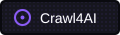
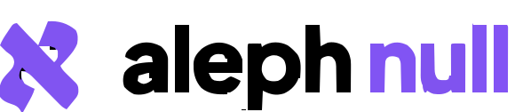

# 🚀🤖 Crawl4AI: the open-source web crawler for LLMs and AI agents

<div align="center">

<a href="https://trendshift.io/repositories/11716" target="_blank"></a>

[](https://github.com/unclecode/crawl4ai/stargazers)
[](https://badge.fury.io/py/crawl4ai)
[](https://pepy.tech/project/crawl4ai)
[](https://discord.gg/jP8KfhDhyN)
[](https://crawl4ai.com/?ref=readme-badge)

**Latest: [v0.9.4](https://github.com/unclecode/crawl4ai/releases/tag/v0.9.4) (23 Sep 2026)** · [all releases →](https://github.com/unclecode/crawl4ai/releases)

<a href="https://crawl4ai.com/?ref=readme-banner">
  <picture>
    <source media="(prefers-color-scheme: dark)" srcset="https://raw.githubusercontent.com/unclecode/crawl4ai/main/docs/assets/cloud-launch-banner-dark.svg">
    
  </picture>
</a>

</div>

Crawl4AI turns any website into clean, LLM-ready Markdown for RAG, AI agents and data pipelines. Run the open-source web crawler and scraper yourself, free forever, or use it hosted with one key: scrape, search and extract through one API, with MCP for your agent.

## Two ways to use Crawl4AI

### 🐍 Run it yourself: open source, forever

```bash
pip install -U crawl4ai
crawl4ai-setup        # installs the browser, once
```

```python
import asyncio
from crawl4ai import AsyncWebCrawler

async def main():
    async with AsyncWebCrawler() as crawler:
        result = await crawler.arun(url="https://news.ycombinator.com")
        print(result.markdown)

asyncio.run(main())
```

Docker server, CLI and every option: [Installation](#installation) · [docs.crawl4ai.com](https://docs.crawl4ai.com)

### ☁️ Or use the cloud: no browsers, no proxies

1. [](https://crawl4ai.com/?ref=readme)  
   Verify your email and your first $10 pack is on us (until 31 December 2026, then $5 to start). No card.
2. Get any page as Markdown:

   ```bash
   curl -s https://api.crawl4ai.com/scrape \
     -H "Authorization: Bearer $CRAWL4AI_KEY" \
     -H "Content-Type: application/json" \
     -d '{"url": "https://news.ycombinator.com"}' | jq -r .markdown
   ```

   The same key works for `/search`, `/answer`, `/extract` and many URLs at once (`/scrape/batch`, `/scrape/jobs`). Pay as you go: [live prices](https://crawl4ai.com/docs?ref=readme#pricing).
3. Give it to your AI agent. Claude Code shown; [Codex, Cursor and OpenCode →](https://crawl4ai.com/docs?ref=readme#mcp)

   ```bash
   claude mcp add --transport http crawl4ai https://api.crawl4ai.com/mcp \
     --header "Authorization: Bearer $CRAWL4AI_KEY"
   ```

### Which one?

| | 🐍 Library | 🐳 Your own server | ☁️ Crawl4AI Cloud |
|---|---|---|---|
| **Runs the browsers** | you, in your Python process | you, in Docker on your machine | we do |
| **JS-heavy pages and bot walls** | your settings, your proxies | your settings, your proxies | handled for you, automatically |
| **Web search** | – | – | `/search` and `/answer` |
| **Price** | free, forever | free (your hosting) | pay as you go; your first $10 is on us |

<details>
  <summary>🤓 <strong>My Personal Story</strong></summary>

I grew up on an Amstrad, thanks to my dad, and never stopped building. In grad school I specialized in NLP and built crawlers for research. That’s where I learned how much extraction matters.

In 2023, I needed web-to-Markdown. The “open source” option wanted an account, API token, and $16, and still under-delivered. I went turbo anger mode, built Crawl4AI in days, and it went viral. Now it’s the most-starred crawler on GitHub.

I made it open source for **availability**, anyone can use it without a gate. Now I’m building the platform for **affordability**, anyone can run serious crawls without breaking the bank. If that resonates, join in, send feedback, or just crawl something amazing.

That platform is live now: [Crawl4AI Cloud](https://crawl4ai.com/?ref=readme).
</details>

<details>
  <summary>Why developers pick Crawl4AI</summary>

- **LLM-ready output**: smart Markdown with headings, tables, code and citation hints
- **Fast in practice**: async browser pool, caching, minimal hops
- **Full control**: sessions, proxies, cookies, user scripts, hooks
- **Adaptive intelligence**: learns site patterns, explores only what matters
- **Deploy anywhere**: no keys needed, CLI and Docker, or the hosted cloud
</details>

## ✨ Features

<details>
<summary>📝 <strong>Markdown generation</strong></summary>

- 🧹 **Clean Markdown**: headings, lists, tables and code blocks, in a structure an LLM reads well.
- 🎯 **Fit Markdown**: filters remove menus, footers and boilerplate: `PruningContentFilterLXML`, `BM25ContentFilter` (for a query) and `LLMContentFilter`.
- 🔗 **Citations**: page links become a numbered reference list.
- 🛠️ **Your own strategy**: plug in a custom Markdown generator.

☁️ Same in the cloud: `POST /scrape` returns this Markdown, with no browser to run. [Docs →](https://crawl4ai.com/docs?ref=readme#scrape)
</details>

<details>
<summary>📊 <strong>Structured data extraction</strong></summary>

- 🔎 **CSS and XPath schemas**: fast extraction with no LLM (`JsonCssExtractionStrategy`, `JsonXPathExtractionStrategy`, `RegexExtractionStrategy`).
- 🪄 **Schema generator**: describe what you want once; `generate_schema` writes a reusable schema.
- 🤖 **LLM extraction**: any LLM provider, open-source or hosted, into a typed JSON schema (`LLMExtractionStrategy`).
- 🧱 **Chunking**: topic, regex and sentence chunking for long pages.
- 🌌 **Cosine similarity**: find the chunks that match a query (`CosineStrategy`).

☁️ Same in the cloud: `POST /extract`, with no LLM key of your own. [Docs →](https://crawl4ai.com/docs?ref=readme#extract)
</details>

<details>
<summary>🌐 <strong>Browser control</strong></summary>

- 🖥️ **Your own browser**: persistent profiles with saved logins, cookies and settings.
- 🔄 **Remote browsers**: connect over the Chrome DevTools Protocol (CDP).
- 🔒 **Sessions**: keep a browser state across multi-step crawls.
- 🧩 **Proxies**: with authentication and rotation.
- 🕶️ **Stealth mode**: `enable_stealth`, and an undetected-browser adapter for sites that detect automation.
- ⚙️ **Full control**: headers, cookies, user agents, viewport.
- 🌍 **Chromium, Firefox and WebKit**.
</details>

<details>
<summary>🔎 <strong>Crawling and scraping</strong></summary>

- 🕸️ **Deep crawl**: BFS, DFS and best-first strategies, with crash recovery (`resume_state`) for long crawls.
- 🧠 **Adaptive crawling**: `AdaptiveCrawler` stops when it has learned enough to answer your query.
- 🌱 **URL discovery**: `AsyncUrlSeeder` (sitemaps, Common Crawl) and `DomainMapper`; `prefetch=True` finds URLs 5 to 10 times faster.
- 🚀 **Dynamic pages**: run JavaScript, wait for elements, scroll the full page (`scan_full_page`) for infinite scroll and lazy images.
- 📸 **Screenshots and PDFs** of any page.
- 🖼️ **Media and links**: images, audio, video, `srcset`, internal and external links, iframes, metadata.
- 📂 **Raw HTML and local files**: `raw:` and `file://`.
- 🛠️ **Hooks** at every step of a crawl.
- 💾 **Caching** to skip repeated fetches.
- ⚡ **Many URLs at once**: `arun_many` with a memory-adaptive dispatcher.

☁️ Same in the cloud: up to 50 URLs in one streamed call, or 10,000 in a background job. [Docs →](https://crawl4ai.com/docs?ref=readme#batch)
</details>

<details>
<summary>🐳 <strong>Self-hosting (Docker)</strong></summary>

- 🔐 **Secure by default**: every endpoint needs your `CRAWL4AI_API_TOKEN`.
- 🧰 **REST API**: `/md`, `/html`, `/crawl`, `/crawl/stream`, `/screenshot`, `/pdf`, `/execute_js`.
- 🤖 **MCP**: connect Claude Code and other agents to your own server.
- 📊 **Monitoring dashboard and playground**, a browser pool with pre-warmed pages.
- 🏗️ **AMD64 and ARM64** images.

☁️ Rather not run a server? The cloud is the same idea, hosted. [Get a key →](https://crawl4ai.com/?ref=readme)
</details>

<details>
<summary>☁️ <strong>What the cloud adds</strong></summary>

- 🔍 **Web search API**: `GET /search`, browser-free, ranked and cleaned. [Docs →](https://crawl4ai.com/docs?ref=readme#search)
- 💬 **Answers**: `GET /answer` gives a direct answer to a question (experimental). [Docs →](https://crawl4ai.com/docs?ref=readme#answer)
- 🧪 **Extraction without your own LLM key**: `POST /extract`. [Docs →](https://crawl4ai.com/docs?ref=readme#extract)
- 🧗 **JS-heavy pages and bot walls**: handled automatically; you never pick an engine. [Docs →](https://crawl4ai.com/docs?ref=readme#scrape)
- 🤝 **MCP for your agent**: one line in Claude Code, Codex, Cursor or OpenCode. [Docs →](https://crawl4ai.com/docs?ref=readme#mcp)
</details>

<a id="installation"></a>

## 🛠️ Installation

<details>
<summary>🐍 <strong>pip</strong></summary>

```bash
pip install -U crawl4ai
crawl4ai-setup      # installs and sets up the browser
crawl4ai-doctor     # checks the installation
```

If the browser setup fails, install it by hand:

```bash
python -m playwright install --with-deps chromium
```

Pre-release versions: `pip install crawl4ai --pre`

**Development install**, for contributors:

```bash
git clone https://github.com/unclecode/crawl4ai.git
cd crawl4ai
pip install -e ".[all]"     # or: pip install -e .   (the core only)
```
</details>

<details>
<summary>🐳 <strong>Docker server</strong></summary>

The server needs a token. Without one it answers only inside its container.

```bash
export CRAWL4AI_API_TOKEN="$(openssl rand -hex 32)"
docker run -d -p 11235:11235 --name crawl4ai --shm-size=1g \
  -e CRAWL4AI_API_TOKEN="$CRAWL4AI_API_TOKEN" \
  unclecode/crawl4ai:latest
```

Test it (allow about 10 seconds for the start):

```bash
curl -s http://localhost:11235/md \
  -H "Authorization: Bearer $CRAWL4AI_API_TOKEN" \
  -H "Content-Type: application/json" \
  -d '{"url": "https://news.ycombinator.com"}' | jq -r .markdown
```

The dashboard is at `http://localhost:11235/dashboard`, the playground at `http://localhost:11235/playground`. LLM keys, MCP and every setting: [Self-hosting guide](https://docs.crawl4ai.com/core/self-hosting/).
</details>

<details>
<summary>⌨️ <strong>Command line (`crwl`)</strong></summary>

```bash
# A page as Markdown
crwl https://news.ycombinator.com -o markdown

# Deep crawl, breadth first, at most 10 pages
crwl https://docs.crawl4ai.com --deep-crawl bfs --max-pages 10

# Ask a question about a page (needs an LLM key: crwl config)
crwl https://www.example.com/products -q "Extract all product prices"
```
</details>

## 🔬 Advanced usage examples

More in [docs/examples](https://github.com/unclecode/crawl4ai/tree/main/docs/examples).

<details>
<summary>📝 <strong>Clean and fit Markdown</strong></summary>

```python
import asyncio
from crawl4ai import AsyncWebCrawler, BrowserConfig, CrawlerRunConfig, CacheMode
from crawl4ai.content_filter_strategy import PruningContentFilterLXML
from crawl4ai.markdown_generation_strategy import DefaultMarkdownGenerator

async def main():
    run_config = CrawlerRunConfig(
        cache_mode=CacheMode.BYPASS,
        markdown_generator=DefaultMarkdownGenerator(
            content_filter=PruningContentFilterLXML(threshold=0.48, threshold_type="fixed", min_word_threshold=0)
        ),
    )
    async with AsyncWebCrawler(config=BrowserConfig(headless=True)) as crawler:
        result = await crawler.arun(url="https://en.wikipedia.org/wiki/Web_crawler", config=run_config)
        print(len(result.markdown.raw_markdown), "characters of raw Markdown")
        print(len(result.markdown.fit_markdown), "characters after the filter")

asyncio.run(main())
```
</details>

<details>
<summary>🖥️ <strong>A JavaScript page and structured data, without an LLM</strong></summary>

```python
import asyncio, json
from crawl4ai import AsyncWebCrawler, BrowserConfig, CrawlerRunConfig, CacheMode, JsonCssExtractionStrategy

schema = {
    "name": "Quotes",
    "baseSelector": "div.quote",
    "fields": [
        {"name": "text", "selector": "span.text", "type": "text"},
        {"name": "author", "selector": "small.author", "type": "text"},
        {"name": "tags", "selector": "a.tag", "type": "list", "fields": [{"name": "tag", "type": "text"}]},
    ],
}

async def main():
    run_config = CrawlerRunConfig(
        extraction_strategy=JsonCssExtractionStrategy(schema),
        scan_full_page=True,   # scroll to the end, so the page loads every quote
        scroll_delay=0.5,
        cache_mode=CacheMode.BYPASS,
    )
    async with AsyncWebCrawler(config=BrowserConfig(headless=True)) as crawler:
        result = await crawler.arun(url="https://quotes.toscrape.com/scroll", config=run_config)
        quotes = json.loads(result.extracted_content)
        print(f"Extracted {len(quotes)} quotes")
        print(json.dumps(quotes[0], indent=2))

asyncio.run(main())
```
</details>

<details>
<summary>📚 <strong>Structured data with an LLM</strong></summary>

```python
import os, asyncio
from pydantic import BaseModel, Field
from crawl4ai import AsyncWebCrawler, CrawlerRunConfig, CacheMode, LLMConfig, LLMExtractionStrategy

class ModelFee(BaseModel):
    model_name: str = Field(..., description="Name of the model.")
    input_fee: str = Field(..., description="Fee for input tokens.")
    output_fee: str = Field(..., description="Fee for output tokens.")

async def main():
    run_config = CrawlerRunConfig(
        cache_mode=CacheMode.BYPASS,
        extraction_strategy=LLMExtractionStrategy(
            # any provider LiteLLM supports, e.g. "ollama/llama3.3" with api_token="no-token"
            llm_config=LLMConfig(provider="openai/gpt-4o-mini", api_token=os.getenv("OPENAI_API_KEY")),
            schema=ModelFee.model_json_schema(),
            extraction_type="schema",
            instruction="Extract every model name with its input and output token fee.",
        ),
    )
    async with AsyncWebCrawler() as crawler:
        result = await crawler.arun(url="https://openai.com/api/pricing/", config=run_config)
        print(result.extracted_content)

asyncio.run(main())
```
</details>

<details>
<summary>🤖 <strong>Your own browser with a saved profile</strong></summary>

```python
import os, asyncio
from pathlib import Path
from crawl4ai import AsyncWebCrawler, BrowserConfig, CrawlerRunConfig, CacheMode

async def main():
    user_data_dir = os.path.join(Path.home(), ".crawl4ai", "browser_profile")
    os.makedirs(user_data_dir, exist_ok=True)
    browser_config = BrowserConfig(headless=True, user_data_dir=user_data_dir, use_persistent_context=True)
    run_config = CrawlerRunConfig(cache_mode=CacheMode.BYPASS, magic=True)
    async with AsyncWebCrawler(config=browser_config) as crawler:
        result = await crawler.arun(url="ADDRESS_OF_A_CHALLENGING_WEBSITE", config=run_config)
        print(result.success, len(result.markdown))

asyncio.run(main())
```
</details>

## 📖 Documentation

- Library docs, guides and API reference: [docs.crawl4ai.com](https://docs.crawl4ai.com/)
- Cloud docs: [crawl4ai.com/docs](https://crawl4ai.com/docs?ref=readme)
- Release notes: [releases](https://github.com/unclecode/crawl4ai/releases) · Roadmap: [ROADMAP.md](https://github.com/unclecode/crawl4ai/blob/main/ROADMAP.md)

## 🤝 Contributing

We welcome contributions from the open-source community. Check out our [contribution guidelines](https://github.com/unclecode/crawl4ai/blob/main/CONTRIBUTORS.md) for more information.

## 📄 License & Attribution

This project is licensed under the Apache License 2.0, attribution is recommended via the badges below. See the [Apache 2.0 License](https://github.com/unclecode/crawl4ai/blob/main/LICENSE) file for details.

### Attribution Requirements
When using Crawl4AI, you must include one of the following attribution methods:

<details>
<summary>📈 <strong>1. Badge Attribution (Recommended)</strong></summary>
Add one of these badges to your README, documentation, or website:

| Theme | Badge |
|-------|-------|
| **Disco Theme (Animated)** | <a href="https://github.com/unclecode/crawl4ai"></a> |
| **Night Theme (Dark with Neon)** | <a href="https://github.com/unclecode/crawl4ai"></a> |
| **Dark Theme (Classic)** | <a href="https://github.com/unclecode/crawl4ai"></a> |
| **Light Theme (Classic)** | <a href="https://github.com/unclecode/crawl4ai"></a> |
 

HTML code for adding the badges:
```html
<!-- Disco Theme (Animated) -->
<a href="https://github.com/unclecode/crawl4ai">
  
</a>

<!-- Night Theme (Dark with Neon) -->
<a href="https://github.com/unclecode/crawl4ai">
  
</a>

<!-- Dark Theme (Classic) -->
<a href="https://github.com/unclecode/crawl4ai">
  
</a>

<!-- Light Theme (Classic) -->
<a href="https://github.com/unclecode/crawl4ai">
  
</a>

<!-- Simple Shield Badge -->
<a href="https://github.com/unclecode/crawl4ai">
  
</a>
```

</details>

<details>
<summary>📖 <strong>2. Text Attribution</strong></summary>
Add this line to your documentation:
```
This project uses Crawl4AI (https://github.com/unclecode/crawl4ai) for web data extraction.
```
</details>

## 📚 Citation

If you use Crawl4AI in your research or project, please cite:

```bibtex
@software{crawl4ai2024,
  author = {UncleCode},
  title = {Crawl4AI: Open-source LLM Friendly Web Crawler & Scraper},
  year = {2024},
  publisher = {GitHub},
  journal = {GitHub Repository},
  howpublished = {\url{https://github.com/unclecode/crawl4ai}},
  commit = {Please use the commit hash you're working with}
}
```

Text citation format:
```
UncleCode. (2024). Crawl4AI: Open-source LLM Friendly Web Crawler & Scraper [Computer software]. 
GitHub. https://github.com/unclecode/crawl4ai
```

## 🗾 Mission

Our mission is to unlock the value of personal and enterprise data by turning digital footprints into structured, useful assets. Crawl4AI gives individuals and organizations open-source tools to extract and structure data, and a fair way to benefit from it. [Full mission statement →](./MISSION.md)

## 💖 Support Crawl4AI

1. ⭐ **Star the repo**: it helps more people find it.
2. ☁️ **Use the cloud**: [crawl4ai.com](https://crawl4ai.com/?ref=readme). It funds the library.
3. 💝 **Sponsor on GitHub**: [github.com/sponsors/unclecode](https://github.com/sponsors/unclecode)
4. 🏢 **Companies**: the sponsor tiers and benefits are in [SPONSORS.md](SPONSORS.md).

## 🌟 Current Sponsors

### 🤝 Strategic Partners

These companies provide core infrastructure and technology that power Crawl4AI’s capabilities — from web access and proxy networks to AI tooling and data pipelines.

| Company | About |
|------|------|
| <a href="https://www.joinmassive.com/" target="_blank"><picture><source media="(prefers-color-scheme: dark)" srcset="docs/assets/sponsors/massive_light.svg"><source media="(prefers-color-scheme: light)" srcset="docs/assets/sponsors/massive.svg"></picture></a> | Massive is a web access API backed by millions of volunteer devices in 195+ countries. AI agents, models, and data pipelines use it to reach any site on the internet, reliably, in real time, and at scale. |

### 🏢 Enterprise Sponsors

Our enterprise sponsors support Crawl4AI and help scale it to power production-grade data pipelines.

| Company | About | Sponsorship Tier |
|------|------|----------------------------|
| <a href="https://kipo.ai" target="_blank"></a> | Helps engineers and buyers find, compare, and source electronic & industrial parts in seconds, with specs, pricing, lead times & alternatives.| 🥇 Gold |
| <a href="https://www.kidocode.com/" target="_blank"></a> | Kidocode is a hybrid technology and entrepreneurship school for kids aged 5–18, offering both online and on-campus education. | 🥇 Gold |
| <a href="https://www.alephnull.sg/" target="_blank"><picture><source media="(prefers-color-scheme: dark)" srcset="docs/assets/sponsors/aleph_null_light.svg"><source media="(prefers-color-scheme: light)" srcset="docs/assets/sponsors/aleph_null.svg"></picture></a> | Singapore-based  Aleph Null is Asia’s leading edtech hub, dedicated to student-centric, AI-driven education—empowering learners with the tools to thrive in a fast-changing world. | 🥇 Gold |

---

### 💼 Become a Strategic Partner or Sponsor

Interested in partnering with Crawl4AI?

Whether you’re a proxy provider, AI infrastructure company, cloud platform, or an organization looking to support the Crawl4AI ecosystem, we’d love to hear from you.

📩 Contact: hello@crawl4ai.com


### 🧑‍🤝 Individual Sponsors

A heartfelt thanks to our individual supporters! Every contribution helps us keep our opensource mission alive and thriving!

<p align="left">
  <a href="https://github.com/hafezparast"></a>
  <a href="https://github.com/ntohidi"></a>
  <a href="https://github.com/Sjoeborg"></a>
  <a href="https://github.com/romek-rozen"></a>
  <a href="https://github.com/Kourosh-Kiyani"></a>
  <a href="https://github.com/Etherdrake"></a>
  <a href="https://github.com/shaman247"></a>
  <a href="https://github.com/work-flow-manager"></a>
</p>

> Want to join them? [Sponsor Crawl4AI →](https://github.com/sponsors/unclecode)

## 📧 Contact

[Discord](https://discord.gg/jP8KfhDhyN) · [X @unclecode](https://x.com/unclecode) · [GitHub @unclecode](https://github.com/unclecode) · hello@crawl4ai.com

- **Building crawlers or AI agents for a living?** DM me on X. I want to work with people like you, and we are hiring.
- **From a company?** We have an enterprise offer and we tailor it to your business. SOC 2 Type I is done, Type II is in progress. Write to hello@crawl4ai.com.

<p align="center">
  <a href="https://github.com/unclecode/crawl4ai/network/members"></a>
  <a href="https://pypi.org/project/crawl4ai/"></a>
  <a href="https://github.com/sponsors/unclecode"></a>
  <a href="https://x.com/crawl4ai"></a>
  <a href="https://www.linkedin.com/company/crawl4ai"></a>
</p>

Happy crawling! 🕸️🚀

## Star History

<a href="https://www.star-history.com/?type=date&repos=unclecode%2Fcrawl4ai">
 <picture>
   <source media="(prefers-color-scheme: dark)" srcset="https://api.star-history.com/chart?repos=unclecode/crawl4ai&type=date&theme=dark&legend=top-left&sealed_token=KuajrA7ScH8VT4KagC7nm1xbazTVaNs6rdok4At2dV6tDl91YR_dxmHhmsffjhFiWdLYlzdACxZ-cWLwp8tZHCYxSDMjITf3Vnu4mPns7YdLetyQBPHMQ2f_KakXdbvbVP6PofI82GNqGCVEXtPnZWHC8WM6CzZe6s6cJb6_ga_kn-jh-BeHdyuRRdVR" />
   <source media="(prefers-color-scheme: light)" srcset="https://api.star-history.com/chart?repos=unclecode/crawl4ai&type=date&legend=top-left&sealed_token=KuajrA7ScH8VT4KagC7nm1xbazTVaNs6rdok4At2dV6tDl91YR_dxmHhmsffjhFiWdLYlzdACxZ-cWLwp8tZHCYxSDMjITf3Vnu4mPns7YdLetyQBPHMQ2f_KakXdbvbVP6PofI82GNqGCVEXtPnZWHC8WM6CzZe6s6cJb6_ga_kn-jh-BeHdyuRRdVR" />
   
 </picture>
</a>
