# Crawl4AI Strategic Roadmap

```mermaid
%%{init: {'themeVariables': { 'fontSize': '14px'}}}%%
graph TD
    subgraph A1[Advanced Crawling Systems 🔧]
        A["`
        • Graph Crawler ✓
        • Question-Based Crawler
        • Knowledge-Optimal Crawler
        • Agentic Crawler
        `"]
    end

    subgraph A2[Specialized Features 🛠️]
        B["`
        • Automated Schema Generator
        • Domain-Specific Scrapers
        • 
        • 
        `"]
    end

    subgraph A3[Development Tools 🔨]
        C["`
        • Interactive Playground
        • Performance Monitor
        • Cloud Integration
        • 
        `"]
    end

    subgraph A4[Community & Growth 🌱]
        D["`
        • Sponsorship Program
        • Educational Content
        • 
        • 
        `"]
    end

    classDef default fill:#f9f9f9,stroke:#333,stroke-width:2px
    classDef section fill:#f0f0f0,stroke:#333,stroke-width:4px,rx:10
    class A1,A2,A3,A4 section

    %% Layout hints
    A1 --> A2[" "]
    A3 --> A4[" "]
    linkStyle 0,1 stroke:none
```



Crawl4AI is evolving to provide more intelligent, efficient, and versatile web crawling capabilities. This roadmap outlines the key developments and features planned for the project, organized into strategic sections that build upon our current foundation.

## 1. Advanced Crawling Systems 🔧

This section introduces three powerful crawling systems that extend Crawl4AI's capabilities from basic web crawling to intelligent, purpose-driven data extraction.

### 1.1 Question-Based Crawler
The Question-Based Crawler enhances our core engine by enabling automatic discovery and extraction of relevant web content based on natural language questions.

Key Features:
- SerpiAPI integration for intelligent web search
- Relevancy scoring for search results
- Automatic URL discovery and prioritization
- Cross-source validation

```python
from crawl4ai import AsyncWebCrawler
from crawl4ai.discovery import QuestionBasedDiscovery

async with AsyncWebCrawler() as crawler:
    discovery = QuestionBasedDiscovery(crawler)
    results = await discovery.arun(
        question="What are the system requirements for major cloud providers' GPU instances?",
        max_urls=5,
        relevance_threshold=0.7
    )
    
    for result in results:
        print(f"Source: {result.url} (Relevance: {result.relevance_score})")
        print(f"Content: {result.markdown}\n")
```

### 1.2 Knowledge-Optimal Crawler
An intelligent crawling system that solves the optimization problem of minimizing data extraction while maximizing knowledge acquisition for specific objectives.

Key Features:
- Smart content prioritization
- Minimal data extraction for maximum knowledge
- Probabilistic relevance assessment
- Objective-driven crawling paths

```python
from crawl4ai import AsyncWebCrawler
from crawl4ai.optimization import KnowledgeOptimizer

async with AsyncWebCrawler() as crawler:
    optimizer = KnowledgeOptimizer(
        objective="Understand GPU instance pricing and limitations across cloud providers",
        required_knowledge=[
            "pricing structure",
            "GPU specifications",
            "usage limits",
            "availability zones"
        ],
        confidence_threshold=0.85
    )
    
    result = await crawler.arun(
        urls=[
            "https://aws.amazon.com/ec2/pricing/",
            "https://cloud.google.com/gpu",
            "https://azure.microsoft.com/pricing/"
        ],
        optimizer=optimizer,
        optimization_mode="minimal_extraction"
    )
    
    print(f"Knowledge Coverage: {result.knowledge_coverage}")
    print(f"Data Efficiency: {result.efficiency_ratio}")
    print(f"Extracted Content: {result.optimal_content}")
```

### 1.3 Agentic Crawler
An autonomous system capable of understanding complex goals and automatically planning and executing multi-step crawling operations.

Key Features:
- Autonomous goal interpretation
- Dynamic step planning
- Interactive navigation capabilities
- Visual recognition and interaction
- Automatic error recovery

```python
from crawl4ai import AsyncWebCrawler
from crawl4ai.agents import CrawlerAgent

async with AsyncWebCrawler() as crawler:
    agent = CrawlerAgent(crawler)
    
    # Automatic planning and execution
    result = await agent.arun(
        goal="Find research papers about quantum computing published in 2023 with more than 50 citations",
        auto_retry=True
    )
    print("Generated Plan:", result.executed_steps)
    print("Extracted Data:", result.data)
    
    # Using custom steps with automatic execution
    result = await agent.arun(
        goal="Extract conference deadlines from ML conferences",
        custom_plan=[
            "Navigate to conference page",
            "Find important dates section",
            "Extract submission deadlines",
            "Verify dates are for 2024"
        ]
    )
    
    # Monitoring execution
    print("Step Completion:", result.step_status)
    print("Execution Time:", result.execution_time)
    print("Success Rate:", result.success_rate)
```

# Section 2: Specialized Features 🛠️

This section introduces specialized tools and features that enhance Crawl4AI's capabilities for specific use cases and data extraction needs.

### 2.1 Automated Schema Generator
A system that automatically generates JsonCssExtractionStrategy schemas from natural language descriptions, making structured data extraction accessible to all users.

Key Features:
- Natural language schema generation
- Automatic pattern detection
- Predefined schema templates
- Chrome extension for visual schema building

```python
from crawl4ai import AsyncWebCrawler
from crawl4ai.schema import SchemaGenerator

# Generate schema from natural language description
generator = SchemaGenerator()
schema = await generator.generate(
    url="https://news-website.com",
    description="For each news article on the page, I need the headline, publication date, and main image"
)

# Use generated schema with crawler
async with AsyncWebCrawler() as crawler:
    result = await crawler.arun(
        url="https://news-website.com",
        extraction_strategy=schema
    )

# Example of generated schema:
"""
{
    "name": "News Article Extractor",
    "baseSelector": "article.news-item",
    "fields": [
        {
            "name": "headline",
            "selector": "h2.article-title",
            "type": "text"
        },
        {
            "name": "date",
            "selector": "span.publish-date",
            "type": "text"
        },
        {
            "name": "image",
            "selector": "img.article-image",
            "type": "attribute",
            "attribute": "src"
        }
    ]
}
"""
```

### 2.2 Domain Specific Scrapers
Specialized extraction strategies optimized for common website types and platforms, providing consistent and reliable data extraction without additional configuration.

Key Features:
- Pre-configured extractors for popular platforms
- Academic site specialization (arXiv, NCBI)
- E-commerce standardization
- Documentation site handling

```python
from crawl4ai import AsyncWebCrawler
from crawl4ai.extractors import AcademicExtractor, EcommerceExtractor

async with AsyncWebCrawler() as crawler:
    # Academic paper extraction
    papers = await crawler.arun(
        url="https://arxiv.org/list/cs.AI/recent",
        extractor="academic",  # Built-in extractor type
        site_type="arxiv",     # Specific site optimization
        extract_fields=[
            "title", 
            "authors", 
            "abstract", 
            "citations"
        ]
    )
    
    # E-commerce product data
    products = await crawler.arun(
        url="https://store.example.com/products",
        extractor="ecommerce",
        extract_fields=[
            "name",
            "price",
            "availability",
            "reviews"
        ]
    )
```

### 2.3 Web Embedding Index
Creates and maintains a semantic search infrastructure for crawled content, enabling efficient retrieval and querying of web content through vector embeddings.

Key Features:
- Automatic embedding generation
- Intelligent content chunking
- Efficient vector storage and indexing
- Semantic search capabilities

```python
from crawl4ai import AsyncWebCrawler
from crawl4ai.indexing import WebIndex

# Initialize and build index
index = WebIndex(model="efficient-mini")

async with AsyncWebCrawler() as crawler:
    # Crawl and index content
    await index.build(
        urls=["https://docs.example.com"],
        crawler=crawler,
        options={
            "chunk_method": "semantic",
            "update_policy": "incremental",
            "embedding_batch_size": 100
        }
    )

    # Search through indexed content
    results = await index.search(
        query="How to implement OAuth authentication?",
        filters={
            "content_type": "technical",
            "recency": "6months"
        },
        top_k=5
    )

    # Get similar content
    similar = await index.find_similar(
        url="https://docs.example.com/auth/oauth",
        threshold=0.85
    )
```

Each of these specialized features builds upon Crawl4AI's core functionality while providing targeted solutions for specific use cases. They can be used independently or combined for more complex data extraction and processing needs.

# Section 3: Development Tools 🔧

This section covers tools designed to enhance the development experience, monitoring, and deployment of Crawl4AI applications.

### 3.1 Crawl4AI Playground 🎮

The Crawl4AI Playground is an interactive web-based development environment that simplifies web scraping experimentation, development, and deployment. With its intuitive interface and AI-powered assistance, users can quickly prototype, test, and deploy web scraping solutions.

#### Key Features 🌟

##### Visual Strategy Builder
- Interactive point-and-click interface for building extraction strategies
- Real-time preview of selected elements
- Side-by-side comparison of different extraction approaches
- Visual validation of CSS selectors and XPath queries

##### AI Assistant Integration
- Strategy recommendations based on target website analysis
- Parameter optimization suggestions
- Best practices guidance for specific use cases
- Automated error detection and resolution
- Performance optimization tips

##### Real-Time Testing & Validation
- Live preview of extraction results
- Side-by-side comparison of multiple strategies
- Performance metrics visualization
- Automatic validation of extracted data
- Error detection and debugging tools

##### Project Management
- Save and organize multiple scraping projects
- Version control for configurations
- Export/import project settings
- Share configurations with team members
- Project templates for common use cases

##### Deployment Pipeline
- One-click deployment to various environments
- Docker container generation
- Cloud deployment templates (AWS, GCP, Azure)
- Scaling configuration management
- Monitoring setup automation


### 3.2 Performance Monitoring System
A comprehensive monitoring solution providing real-time insights into crawler operations, resource usage, and system health through both CLI and GUI interfaces.

Key Features:
- Real-time resource tracking
- Active crawl monitoring
- Performance statistics
- Customizable alerting system

```python
from crawl4ai import AsyncWebCrawler
from crawl4ai.monitor import CrawlMonitor

# Initialize monitoring
monitor = CrawlMonitor()

# Start monitoring with CLI interface
await monitor.start(
    mode="cli",  # or "gui"
    refresh_rate="1s",
    metrics={
        "resources": ["cpu", "memory", "network"],
        "crawls": ["active", "queued", "completed"],
        "performance": ["success_rate", "response_times"]
    }
)

# Example CLI output:
"""
Crawl4AI Monitor (Live) - Press Q to exit
────────────────────────────────────────
System Usage:
 ├─ CPU: ███████░░░ 70%
 └─ Memory: ████░░░░░ 2.1GB/8GB

Active Crawls:
ID    URL                   Status    Progress
001   docs.example.com     🟢 Active   75%
002   api.service.com      🟡 Queue    -

Metrics (Last 5min):
 ├─ Success Rate: 98%
 ├─ Avg Response: 0.6s
 └─ Pages/sec: 8.5
"""
```

### 3.3 Cloud Integration
Streamlined deployment tools for setting up Crawl4AI in various cloud environments, with support for scaling and monitoring.

Key Features:
- One-click deployment solutions
- Auto-scaling configuration
- Load balancing setup
- Cloud-specific optimizations
- Monitoring integration

```python
from crawl4ai import AsyncWebCrawler
from crawl4ai.deploy import CloudDeployer

# Initialize deployer
deployer = CloudDeployer()

# Deploy crawler service
deployment = await deployer.deploy(
    service_name="crawler-cluster",
    platform="aws",  # or "gcp", "azure"
    config={
        "instance_type": "compute-optimized",
        "auto_scaling": {
            "min_instances": 2,
            "max_instances": 10,
            "scale_based_on": "cpu_usage"
        },
        "region": "us-east-1",
        "monitoring": True
    }
)

# Get deployment status and endpoints
print(f"Service Status: {deployment.status}")
print(f"API Endpoint: {deployment.endpoint}")
print(f"Monitor URL: {deployment.monitor_url}")
```

These development tools work together to provide a comprehensive environment for developing, testing, monitoring, and deploying Crawl4AI applications. The Playground helps users experiment and generate optimal configurations, the Performance Monitor ensures smooth operation, and the Cloud Integration tools simplify deployment and scaling.

# Section 4: Community & Growth 🌱

This section outlines initiatives designed to build and support the Crawl4AI community, provide educational resources, and ensure sustainable project growth.

### 4.1 Sponsorship Program
A structured program to support ongoing development and maintenance of Crawl4AI while providing valuable benefits to sponsors.

Key Features:
- Multiple sponsorship tiers
- Sponsor recognition system
- Priority support for sponsors
- Early access to new features
- Custom feature development opportunities

Program Structure (not yet finalized):
```
Sponsorship Tiers:

🥉 Bronze Supporter
- GitHub Sponsor badge
- Priority issue response
- Community Discord role

🥈 Silver Supporter
- All Bronze benefits
- Technical support channel
- Vote on roadmap priorities
- Early access to beta features

🥇 Gold Supporter
- All Silver benefits
- Custom feature requests
- Direct developer access
- Private support sessions

💎 Diamond Partner
- All Gold benefits
- Custom development
- On-demand consulting
- Integration support
```

### 4.2 "How to Crawl" Video Series
A comprehensive educational resource teaching users how to effectively use Crawl4AI for various web scraping and data extraction scenarios.

Key Features:
- Step-by-step tutorials
- Real-world use cases
- Best practices
- Integration guides
- Advanced feature deep-dives

These community initiatives are designed to:
- Provide comprehensive learning resources
- Foster a supportive user community
- Ensure sustainable project development
- Share knowledge and best practices
- Create opportunities for collaboration

The combination of structured support through sponsorship, educational content through video series, and interactive learning through the playground creates a robust ecosystem for both new and experienced users of Crawl4AI.
