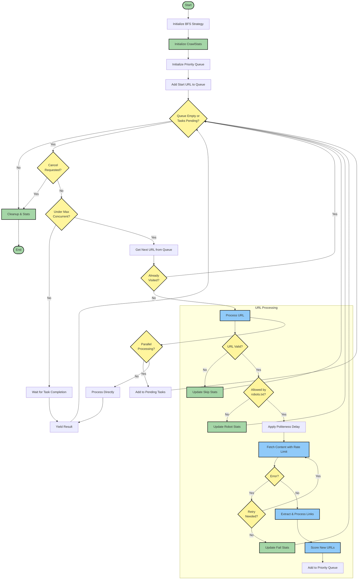

# BFS Scraper Strategy: Smart Web Traversal

The BFS (Breadth-First Search) Scraper Strategy provides an intelligent way to traverse websites systematically. It crawls websites level by level, ensuring thorough coverage while respecting web crawling etiquette.



## How It Works

The BFS strategy crawls a website by:
1. Starting from a root URL
2. Processing all URLs at the current depth
3. Moving to URLs at the next depth level
4. Continuing until maximum depth is reached

This ensures systematic coverage of the website while maintaining control over the crawling process.

## Key Features

### 1. Smart URL Processing
```python
strategy = BFSScraperStrategy(
    max_depth=2,
    filter_chain=my_filters,
    url_scorer=my_scorer,
    max_concurrent=5
)
```
- Controls crawl depth
- Filters unwanted URLs
- Scores URLs for priority
- Manages concurrent requests

### 2. Polite Crawling
The strategy automatically implements web crawling best practices:
- Respects robots.txt
- Implements rate limiting
- Adds politeness delays
- Manages concurrent requests

### 3. Link Processing Control
```python
strategy = BFSScraperStrategy(
    ...,
    process_external_links=False  # Only process internal links
)
```
- Control whether to follow external links
- Default: internal links only
- Enable external links when needed

## Configuration Options

| Parameter | Description | Default |
|-----------|-------------|---------|
| max_depth | Maximum crawl depth | Required |
| filter_chain | URL filtering rules | Required |
| url_scorer | URL priority scoring | Required |
| max_concurrent | Max parallel requests | 5 |
| min_crawl_delay | Seconds between requests | 1 |
| process_external_links | Follow external links | False |

## Best Practices

1. **Set Appropriate Depth**
   - Start with smaller depths (2-3)
   - Increase based on needs
   - Consider site structure

2. **Configure Filters**
   - Use URL patterns
   - Filter by content type
   - Avoid unwanted sections

3. **Tune Performance**
   - Adjust max_concurrent
   - Set appropriate delays
   - Monitor resource usage

4. **Handle External Links**
   - Keep external_links=False for focused crawls
   - Enable only when needed
   - Consider additional filtering

## Example Usage

```python
from crawl4ai.scraper import BFSScraperStrategy
from crawl4ai.scraper.filters import FilterChain
from crawl4ai.scraper.scorers import BasicURLScorer

# Configure strategy
strategy = BFSScraperStrategy(
    max_depth=3,
    filter_chain=FilterChain([
        URLPatternFilter("*.example.com/*"),
        ContentTypeFilter(["text/html"])
    ]),
    url_scorer=BasicURLScorer(),
    max_concurrent=5,
    min_crawl_delay=1,
    process_external_links=False
)

# Use with AsyncWebScraper
scraper = AsyncWebScraper(crawler, strategy)
results = await scraper.ascrape("https://example.com")
```

## Common Use Cases

### 1. Site Mapping
```python
strategy = BFSScraperStrategy(
    max_depth=5,
    filter_chain=site_filter,
    url_scorer=depth_scorer,
    process_external_links=False
)
```
Perfect for creating complete site maps or understanding site structure.

### 2. Content Aggregation
```python
strategy = BFSScraperStrategy(
    max_depth=2,
    filter_chain=content_filter,
    url_scorer=relevance_scorer,
    max_concurrent=3
)
```
Ideal for collecting specific types of content (articles, products, etc.).

### 3. Link Analysis
```python
strategy = BFSScraperStrategy(
    max_depth=1,
    filter_chain=link_filter,
    url_scorer=link_scorer,
    process_external_links=True
)
```
Useful for analyzing both internal and external link structures.

## Advanced Features

### Progress Monitoring
```python
async for result in scraper.ascrape(url):
    print(f"Current depth: {strategy.stats.current_depth}")
    print(f"Processed URLs: {strategy.stats.urls_processed}")
```

### Custom URL Scoring
```python
class CustomScorer(URLScorer):
    def score(self, url: str) -> float:
        # Lower scores = higher priority
        return score_based_on_criteria(url)
```

## Troubleshooting

1. **Slow Crawling**
   - Increase max_concurrent
   - Adjust min_crawl_delay
   - Check network conditions

2. **Missing Content**
   - Verify max_depth
   - Check filter settings
   - Review URL patterns

3. **High Resource Usage**
   - Reduce max_concurrent
   - Increase crawl delay
   - Add more specific filters

