# 🔬 Building an AI Research Assistant with Crawl4AI: Smart URL Discovery

[](https://colab.research.google.com/drive/1QIwVYrQaZGPJQGHQBvMSbkdnc5usqoGw#scrollTo=xbV1w9YM4LkW)

## Welcome to the Research Pipeline Workshop!

In this tutorial, we'll build an **AI-powered research assistant** that intelligently discovers, filters, and analyzes web content. Instead of blindly crawling hundreds of pages, we'll use Crawl4AI's URL Seeder to:

- 🔍 **Discover all available URLs** without crawling them first
- 🎯 **Score and rank** them by relevance using AI
- 🕷️ **Crawl only the most relevant** content
- 🤖 **Generate research insights** with proper citations

By the end, you'll have a complete research pipeline that can analyze any topic across multiple websites efficiently.

## What You'll Build

A **smart research assistant** that:
1. Takes any research query (e.g., "Premier League transfer news")
2. Discovers relevant articles from news sites
3. Ranks them by relevance using BM25 scoring
4. Crawls only the top-ranked articles
5. Synthesizes findings into a comprehensive report

## Prerequisites

- Python 3.8+ environment
- Basic understanding of async Python
- API keys for LLM (Gemini or OpenAI recommended)

## Pipeline Overview

```
User Query → Query Enhancement → URL Discovery → Relevance Scoring → Smart Crawling → AI Synthesis → Research Report
```

Each step builds on the previous one, creating an efficient research system that saves time and resources.

Let's begin! 🚀

---

# cell 1 type:markdown
## Step 0: Environment Setup and Dependencies

First, we'll set up our environment with all necessary libraries. We need Crawl4AI for intelligent web crawling, LiteLLM for AI integration, and Rich for beautiful terminal output. This foundation ensures our research assistant has all the tools it needs.

# cell 2 type:code
# Install required packages
!pip install -q crawl4ai litellm rich

# cell 3 type:code
import asyncio
import json
import os
from typing import List, Dict, Optional, Tuple
from dataclasses import dataclass, asdict
from datetime import datetime
from pathlib import Path

# Rich for beautiful console output
from rich.console import Console
from rich.panel import Panel
from rich.table import Table
from rich.progress import Progress, SpinnerColumn, TextColumn

# Crawl4AI imports for intelligent crawling
from crawl4ai import (
    AsyncWebCrawler, 
    BrowserConfig, 
    CrawlerRunConfig,
    AsyncUrlSeeder, 
    SeedingConfig,
    AsyncLogger
)
from crawl4ai.content_filter_strategy import PruningContentFilter
from crawl4ai.markdown_generation_strategy import DefaultMarkdownGenerator

# LiteLLM for AI capabilities
import litellm

# Initialize Rich console for pretty output
console = Console()

print("✅ Environment ready! All dependencies loaded successfully.")

# cell 4 type:markdown
## Step 1: Configuration and Data Classes

Here we define our research pipeline configuration. These dataclasses act as our control center, allowing us to fine-tune every aspect of the research process. Think of them as the settings panel for your research assistant - from discovery limits to AI model choices.

# cell 5 type:code
@dataclass
class ResearchConfig:
    """Configuration for the research pipeline
    
    This class controls every aspect of our research assistant:
    - How many URLs to discover and crawl
    - Which scoring methods to use
    - Whether to use AI enhancement
    - Output preferences
    """
    # Core settings
    domain: str = "www.bbc.com/sport"
    max_urls_discovery: int = 100    # Cast a wide net initially
    max_urls_to_crawl: int = 10      # But only crawl the best
    top_k_urls: int = 10             # Focus on top results
    
    # Scoring and filtering
    score_threshold: float = 0.3     # Minimum relevance score
    scoring_method: str = "bm25"     # BM25 is great for relevance
    
    # AI and processing
    use_llm_enhancement: bool = True  # Enhance queries with AI
    llm_model: str = "gemini/gemini-1.5-flash"  # Fast and capable
    
    # URL discovery options
    extract_head_metadata: bool = True  # Get titles, descriptions
    live_check: bool = False           # Verify URLs are accessible
    force_refresh: bool = False        # Bypass cache
    
    # Crawler settings
    max_concurrent_crawls: int = 5     # Parallel crawling
    timeout: int = 30000              # 30 second timeout
    headless: bool = True             # No browser window
    
    # Output settings
    output_dir: Path = Path("research_results")
    verbose: bool = True

@dataclass
class ResearchQuery:
    """Container for research query and metadata"""
    original_query: str
    enhanced_query: Optional[str] = None
    search_patterns: List[str] = None
    timestamp: str = None

@dataclass
class ResearchResult:
    """Container for research results"""
    query: ResearchQuery
    discovered_urls: List[Dict]
    crawled_content: List[Dict]
    synthesis: str
    citations: List[Dict]
    metadata: Dict

# Create default configuration
config = ResearchConfig()
console.print(Panel(
    f"[bold cyan]Research Configuration[/bold cyan]\n\n"
    f"🌐 Domain: {config.domain}\n"
    f"🔍 Max Discovery: {config.max_urls_discovery} URLs\n"
    f"🕷️ Max Crawl: {config.max_urls_to_crawl} pages\n"
    f"🤖 AI Model: {config.llm_model}",
    title="⚙️ Settings"
))

# cell 6 type:markdown
## Step 2: Query Enhancement with AI

Not all search queries are created equal. Here we use AI to transform simple queries into comprehensive search strategies. The LLM analyzes your query, extracts key concepts, and generates related terms - turning "football news" into a rich set of search patterns.

# cell 7 type:code
async def enhance_query_with_llm(query: str, config: ResearchConfig) -> ResearchQuery:
    """
    Transform simple queries into comprehensive search strategies
    
    Why enhance queries?
    - Users often use simple terms ("football news")
    - But relevant content might use varied terminology
    - AI helps capture all relevant variations
    """
    console.print(f"\n[cyan]🤖 Enhancing query: '{query}'...[/cyan]")
    
    try:
        # Ask AI to analyze and expand the query
        response = await litellm.acompletion(
            model=config.llm_model,
            messages=[{
                "role": "user", 
                "content": f"""Given this research query: "{query}"
                
                Extract:
                1. Key terms and concepts (as a list)
                2. Related search terms
                3. A more specific/enhanced version of the query
                
                Return as JSON:
                {{
                    "key_terms": ["term1", "term2"],
                    "related_terms": ["related1", "related2"],
                    "enhanced_query": "enhanced version of query"
                }}"""
            }],
            temperature=0.3,  # Low temperature for consistency
            response_format={"type": "json_object"}
        )
        
        data = json.loads(response.choices[0].message.content)
        
        # Create search patterns from extracted terms
        # These patterns help the URL seeder find relevant pages
        all_terms = data["key_terms"] + data["related_terms"]
        patterns = [f"*{term.lower()}*" for term in all_terms]
        
        result = ResearchQuery(
            original_query=query,
            enhanced_query=data["enhanced_query"],
            search_patterns=patterns[:10],  # Limit to 10 patterns
            timestamp=datetime.now().isoformat()
        )
        
        # Show the enhancement
        console.print(Panel(
            f"[green]✅ Enhanced Query:[/green] {result.enhanced_query}\n"
            f"[dim]Key terms: {', '.join(data['key_terms'])}[/dim]",
            title="🔍 Query Enhancement"
        ))
        
        return result
        
    except Exception as e:
        console.print(f"[yellow]⚠️ Enhancement failed, using original query: {e}[/yellow]")
        # Fallback to simple tokenization
        words = query.lower().split()
        patterns = [f"*{word}*" for word in words if len(word) > 2]
        
        return ResearchQuery(
            original_query=query,
            enhanced_query=query,
            search_patterns=patterns,
            timestamp=datetime.now().isoformat()
        )

# Example usage
test_query = "Premier League transfer news"
enhanced = await enhance_query_with_llm(test_query, config)

# cell 8 type:markdown
## Step 3: Smart URL Discovery with AsyncUrlSeeder

This is where the magic begins! Instead of crawling pages to find links, AsyncUrlSeeder discovers URLs from sitemaps and Common Crawl data. It's like having a map of the entire website before you start exploring. We'll discover hundreds of URLs in seconds, complete with metadata.

# cell 9 type:code
async def discover_urls(
    domain: str, 
    query: ResearchQuery, 
    config: ResearchConfig
) -> List[Dict]:
    """
    Discover and rank URLs without crawling them
    
    The URL Seeder is incredibly powerful because it:
    1. Gets URLs from sitemaps (official site maps)
    2. Gets URLs from Common Crawl (web-scale data)
    3. Extracts metadata without full page loads
    4. Scores relevance using BM25 algorithm
    
    This means we know which pages are worth crawling
    BEFORE we spend time crawling them!
    """
    console.print(f"\n[cyan]🔍 Discovering URLs from {domain}...[/cyan]")
    
    # Use context manager for automatic cleanup
    async with AsyncUrlSeeder(logger=AsyncLogger(verbose=config.verbose)) as seeder:
        # Configure the discovery process
        seeding_config = SeedingConfig(
            # Data sources
            source="sitemap+cc",  # Use both sitemap AND Common Crawl
            
            # Metadata extraction
            extract_head=config.extract_head_metadata,  # Get titles, descriptions
            
            # Relevance scoring
            query=query.enhanced_query or query.original_query,
            scoring_method=config.scoring_method,  # BM25 scoring
            score_threshold=config.score_threshold,  # Minimum score
            
            # Limits and performance
            max_urls=config.max_urls_discovery,
            live_check=config.live_check,  # Verify URLs work
            force=config.force_refresh,  # Bypass cache if needed
            
            # Performance tuning
            concurrency=20,  # Parallel workers
        )
        
        try:
            # Discover URLs - this is FAST!
            urls = await seeder.urls(domain, seeding_config)
            
            # Results are already sorted by relevance
            # thanks to BM25 scoring
            top_urls = urls[:config.top_k_urls]
            
            # Show discovery results
            console.print(f"[green]✅ Discovered {len(urls)} URLs, selected top {len(top_urls)}[/green]")
            
            # Display a sample of what we found
            if top_urls:
                table = Table(title="🎯 Top Discovered URLs")
                table.add_column("Score", style="cyan")
                table.add_column("Title", style="green")
                table.add_column("URL", style="dim")
                
                for url in top_urls[:5]:
                    score = f"{url.get('relevance_score', 0):.3f}"
                    title = "N/A"
                    if url.get('head_data') and url['head_data'].get('title'):
                        title = url['head_data']['title'][:50] + "..."
                    url_str = url['url'][:60] + "..."
                    
                    table.add_row(score, title, url_str)
                
                console.print(table)
            
            return top_urls
            
        except Exception as e:
            console.print(f"[red]❌ URL discovery failed: {e}[/red]")
            return []

# Example discovery
discovered = await discover_urls(config.domain, enhanced, config)

# cell 10 type:markdown
## Step 4: Intelligent Content Crawling

Now we crawl only the most relevant URLs. This is where our smart filtering pays off - instead of crawling hundreds of pages, we focus on the top 10-20 most relevant ones. We use content filtering to extract only the meaningful text, removing ads and navigation.

# cell 11 type:code
async def crawl_selected_urls(
    urls: List[Dict], 
    query: ResearchQuery, 
    config: ResearchConfig
) -> List[Dict]:
    """
    Crawl only the most relevant URLs with smart content filtering
    
    Key optimizations:
    1. We already know these URLs are relevant (from scoring)
    2. We crawl them in parallel for speed
    3. We extract only meaningful content (no ads/nav)
    4. We generate clean markdown for analysis
    """
    # Extract URLs from discovery results
    url_list = [u['url'] for u in urls if 'url' in u][:config.max_urls_to_crawl]
    
    if not url_list:
        console.print("[red]❌ No URLs to crawl[/red]")
        return []
    
    console.print(f"\n[cyan]🕷️ Crawling {len(url_list)} URLs...[/cyan]")
    
    # Configure intelligent content extraction
    # This removes ads, navigation, and other noise
    md_generator = DefaultMarkdownGenerator(
        content_filter=PruningContentFilter(
            threshold=0.48,  # Content relevance threshold
            threshold_type="dynamic",  # Adapts to page structure
            min_word_threshold=10  # Ignore tiny text blocks
        ),
    )
    
    # Configure the crawler
    crawler_config = CrawlerRunConfig(
        markdown_generator=md_generator,
        exclude_external_links=True,  # Focus on content, not links
        excluded_tags=['nav', 'header', 'footer', 'aside'],  # Skip UI elements
    )
    
    # Create crawler with browser config
    async with AsyncWebCrawler(
        config=BrowserConfig(
            headless=config.headless,
            verbose=config.verbose
        )
    ) as crawler:
        # Crawl URLs in parallel for speed
        # arun_many handles concurrency automatically
        results = await crawler.arun_many(
            url_list,
            config=crawler_config,
            max_concurrent=config.max_concurrent_crawls
        )
        
        # Process successful results
        crawled_content = []
        for url, result in zip(url_list, results):
            if result.success:
                # Extract the content we need
                content_data = {
                    'url': url,
                    'title': result.metadata.get('title', 'No title'),
                    'markdown': result.markdown.fit_markdown or result.markdown.raw_markdown,
                    'metadata': result.metadata
                }
                crawled_content.append(content_data)
                console.print(f"  [green]✓[/green] Crawled: {url[:60]}...")
            else:
                console.print(f"  [red]✗[/red] Failed: {url[:50]}... - {result.error}")
    
    console.print(f"[green]✅ Successfully crawled {len(crawled_content)} pages[/green]")
    return crawled_content

# Example crawling
crawled = await crawl_selected_urls(discovered[:5], enhanced, config)

# cell 12 type:markdown
## Step 5: AI-Powered Research Synthesis

This is where we transform raw content into insights. The AI analyzes all crawled articles, identifies key themes, and generates a comprehensive synthesis with proper citations. It's like having a research assistant read everything and write you a summary.

# cell 13 type:code
async def generate_research_synthesis(
    query: ResearchQuery,
    crawled_content: List[Dict],
    config: ResearchConfig
) -> Tuple[str, List[Dict]]:
    """
    Use AI to synthesize findings from multiple sources
    
    The synthesis process:
    1. Sends all content to the LLM
    2. Asks for key findings and analysis
    3. Ensures proper citation of sources
    4. Generates actionable insights
    """
    if not crawled_content:
        return "No content available for synthesis.", []
    
    console.print("\n[cyan]🤖 Generating research synthesis...[/cyan]")
    
    # Prepare content for the AI
    # We include source info for proper citations
    content_sections = []
    for i, content in enumerate(crawled_content, 1):
        section = f"""
SOURCE {i}:
Title: {content['title']}
URL: {content['url']}
Content Preview:
{content['markdown'][:1500]}...
"""
        content_sections.append(section)
    
    combined_content = "\n---\n".join(content_sections)
    
    try:
        # Generate comprehensive synthesis
        response = await litellm.acompletion(
            model=config.llm_model,
            messages=[{
                "role": "user",
                "content": f"""Research Query: "{query.original_query}"

Based on the following sources, provide a comprehensive research synthesis.

{combined_content}

Please provide:
1. An executive summary (2-3 sentences)
2. Key findings (3-5 bullet points)
3. Detailed analysis (2-3 paragraphs)
4. Future implications or trends

Format your response with clear sections and cite sources using [Source N] notation.
Keep the total response under 800 words."""
            }],
            temperature=0.7  # Some creativity for synthesis
        )
        
        synthesis = response.choices[0].message.content
        
        # Extract citations from the synthesis
        citations = []
        for i, content in enumerate(crawled_content, 1):
            # Check if this source was cited
            if f"[Source {i}]" in synthesis or f"Source {i}" in synthesis:
                citations.append({
                    'source_id': i,
                    'title': content['title'],
                    'url': content['url']
                })
        
        return synthesis, citations
        
    except Exception as e:
        console.print(f"[red]❌ Synthesis generation failed: {e}[/red]")
        # Fallback to simple summary
        summary = f"Research on '{query.original_query}' found {len(crawled_content)} relevant articles:\n\n"
        for content in crawled_content[:3]:
            summary += f"- {content['title']}\n  {content['url']}\n\n"
        return summary, []

# Example synthesis
synthesis, citations = await generate_research_synthesis(enhanced, crawled, config)
console.print(Panel(synthesis[:500] + "...", title="📝 Research Synthesis Preview"))

# cell 14 type:markdown
## Step 6: Complete Research Pipeline

Now let's put it all together! This orchestrator function manages the entire research pipeline from query to final report. It coordinates all the components we've built, handling errors gracefully and providing progress updates.

# cell 15 type:code
async def research_pipeline(
    query: str,
    config: ResearchConfig = None
) -> ResearchResult:
    """
    Main research pipeline orchestrator
    
    This brings together all components:
    1. Query enhancement (AI-powered)
    2. URL discovery (AsyncUrlSeeder)
    3. Smart crawling (AsyncWebCrawler)
    4. AI synthesis (LiteLLM)
    
    Returns a complete research result
    """
    if config is None:
        config = ResearchConfig()
    
    start_time = datetime.now()
    
    # Display pipeline header
    console.print(Panel(
        f"[bold cyan]Research Pipeline[/bold cyan]\n\n"
        f"[dim]Query:[/dim] {query}\n"
        f"[dim]Domain:[/dim] {config.domain}",
        title="🚀 Starting Research",
        border_style="cyan"
    ))
    
    # Step 1: Enhance query
    console.print(f"\n[bold cyan]📝 Step 1: Query Processing[/bold cyan]")
    if config.use_llm_enhancement:
        research_query = await enhance_query_with_llm(query, config)
    else:
        # Simple fallback without AI
        research_query = ResearchQuery(
            original_query=query,
            enhanced_query=query,
            search_patterns=[f"*{word}*" for word in query.lower().split()],
            timestamp=datetime.now().isoformat()
        )
    
    # Step 2: Discover URLs
    console.print(f"\n[bold cyan]🔍 Step 2: URL Discovery[/bold cyan]")
    discovered_urls = await discover_urls(
        domain=config.domain,
        query=research_query,
        config=config
    )
    
    if not discovered_urls:
        # No URLs found - return empty result
        return ResearchResult(
            query=research_query,
            discovered_urls=[],
            crawled_content=[],
            synthesis="No relevant URLs found for the given query.",
            citations=[],
            metadata={'duration': str(datetime.now() - start_time)}
        )
    
    # Step 3: Crawl selected URLs
    console.print(f"\n[bold cyan]🕷️ Step 3: Content Crawling[/bold cyan]")
    crawled_content = await crawl_selected_urls(
        urls=discovered_urls,
        query=research_query,
        config=config
    )
    
    # Step 4: Generate synthesis
    console.print(f"\n[bold cyan]🤖 Step 4: Synthesis Generation[/bold cyan]")
    synthesis, citations = await generate_research_synthesis(
        query=research_query,
        crawled_content=crawled_content,
        config=config
    )
    
    # Create final result
    result = ResearchResult(
        query=research_query,
        discovered_urls=discovered_urls,
        crawled_content=crawled_content,
        synthesis=synthesis,
        citations=citations,
        metadata={
            'duration': str(datetime.now() - start_time),
            'domain': config.domain,
            'timestamp': datetime.now().isoformat(),
            'total_discovered': len(discovered_urls),
            'total_crawled': len(crawled_content),
            'total_cited': len(citations)
        }
    )
    
    # Display summary
    duration = datetime.now() - start_time
    console.print(Panel(
        f"[bold green]✅ Research completed in {duration}[/bold green]\n\n"
        f"📊 Discovered: {len(discovered_urls)} URLs\n"
        f"🕷️ Crawled: {len(crawled_content)} pages\n"
        f"📚 Citations: {len(citations)} sources",
        title="🎉 Pipeline Complete",
        border_style="green"
    ))
    
    return result

# Example: Run complete pipeline
result = await research_pipeline("Champions League latest results", config)

# cell 16 type:markdown
## Step 7: Beautiful Output Formatting

A good research report needs clear presentation. Here we format our results into a professional report with executive summary, key findings, and proper citations. This makes the research actionable and easy to share.

# cell 17 type:code
def format_research_output(result: ResearchResult) -> None:
    """
    Create a beautifully formatted research report
    
    Good formatting makes insights actionable:
    - Clear structure with sections
    - Highlighted key findings
    - Proper source attribution
    - Easy to scan and understand
    """
    # Header
    console.print("\n" + "=" * 60)
    console.print("[bold cyan]🔬 RESEARCH REPORT[/bold cyan]")
    console.print("=" * 60)
    
    # Query information
    console.print(f"\n[bold]Query:[/bold] {result.query.original_query}")
    if result.query.enhanced_query != result.query.original_query:
        console.print(f"[dim]Enhanced: {result.query.enhanced_query}[/dim]")
    
    # Statistics
    stats_table = Table(show_header=False, box=None)
    stats_table.add_column(style="cyan")
    stats_table.add_column()
    
    stats_table.add_row("📊 URLs Discovered", str(result.metadata['total_discovered']))
    stats_table.add_row("🕷️ Pages Crawled", str(result.metadata['total_crawled']))
    stats_table.add_row("📚 Sources Cited", str(result.metadata['total_cited']))
    stats_table.add_row("⏱️ Processing Time", result.metadata['duration'])
    
    console.print("\n[bold]Statistics:[/bold]")
    console.print(stats_table)
    
    # Synthesis
    console.print("\n[bold]📝 SYNTHESIS[/bold]")
    console.print("-" * 60)
    console.print(result.synthesis)
    
    # Citations
    if result.citations:
        console.print("\n[bold]📚 SOURCES[/bold]")
        console.print("-" * 60)
        for citation in result.citations:
            console.print(f"\n[{citation['source_id']}] [cyan]{citation['title']}[/cyan]")
            console.print(f"    [dim]{citation['url']}[/dim]")
    
    # Top discovered URLs
    console.print("\n[bold]🔍 TOP DISCOVERED URLS[/bold]")
    console.print("-" * 60)
    
    urls_table = Table()
    urls_table.add_column("Score", style="cyan")
    urls_table.add_column("Title")
    urls_table.add_column("URL", style="dim")
    
    for url_data in result.discovered_urls[:5]:
        score = f"{url_data.get('relevance_score', 0):.3f}"
        title = "N/A"
        if url_data.get('head_data') and url_data['head_data'].get('title'):
            title = url_data['head_data']['title'][:40] + "..."
        url = url_data['url'][:50] + "..."
        
        urls_table.add_row(score, title, url)
    
    console.print(urls_table)

# Display the formatted report
format_research_output(result)

# cell 18 type:markdown
## Step 8: Save Research Results

Finally, let's save our research for future reference. We'll create both JSON (for data analysis) and Markdown (for reading) formats. This ensures your research is preserved and shareable.

# cell 19 type:code
async def save_research_results(
    result: ResearchResult, 
    config: ResearchConfig
) -> Tuple[Path, Path]:
    """
    Save research results in multiple formats
    
    Why save in multiple formats?
    - JSON: Perfect for further analysis or automation
    - Markdown: Human-readable, great for sharing
    """
    # Create output directory
    config.output_dir.mkdir(parents=True, exist_ok=True)
    
    # Generate filename based on query and timestamp
    timestamp = datetime.now().strftime("%Y%m%d_%H%M%S")
    query_slug = result.query.original_query[:30].replace(" ", "_").replace("/", "_")
    base_filename = f"{timestamp}_{query_slug}"
    
    # Save JSON
    json_path = config.output_dir / f"{base_filename}.json"
    with open(json_path, 'w') as f:
        json.dump(asdict(result), f, indent=2, default=str)
    
    # Create markdown report
    md_content = [
        f"# Research Report: {result.query.original_query}",
        f"\n**Generated on:** {result.metadata.get('timestamp', 'N/A')}",
        f"\n**Domain:** {result.metadata.get('domain', 'N/A')}",
        f"\n**Processing time:** {result.metadata.get('duration', 'N/A')}",
        "\n---\n",
        "## Query Information",
        f"- **Original Query:** {result.query.original_query}",
        f"- **Enhanced Query:** {result.query.enhanced_query or 'N/A'}",
        "\n## Statistics",
        f"- **URLs Discovered:** {result.metadata['total_discovered']}",
        f"- **Pages Crawled:** {result.metadata['total_crawled']}",
        f"- **Sources Cited:** {result.metadata['total_cited']}",
        "\n## Research Synthesis\n",
        result.synthesis,
        "\n## Sources\n"
    ]
    
    # Add citations
    for citation in result.citations:
        md_content.extend([
            f"### [{citation['source_id']}] {citation['title']}",
            f"- **URL:** [{citation['url']}]({citation['url']})",
            ""
        ])
    
    # Add discovered URLs
    md_content.extend([
        "\n## Discovered URLs (Top 10)\n",
        "| Score | Title | URL |",
        "|-------|-------|-----|"
    ])
    
    for url_data in result.discovered_urls[:10]:
        score = url_data.get('relevance_score', 0)
        title = 'N/A'
        if url_data.get('head_data') and url_data['head_data'].get('title'):
            title = url_data['head_data']['title'][:50] + '...'
        url = url_data['url'][:60] + '...'
        md_content.append(f"| {score:.3f} | {title} | {url} |")
    
    # Save markdown
    md_path = config.output_dir / f"{base_filename}.md"
    with open(md_path, 'w') as f:
        f.write('\n'.join(md_content))
    
    console.print(f"\n[green]💾 Results saved:[/green]")
    console.print(f"  JSON: {json_path}")
    console.print(f"  Markdown: {md_path}")
    
    return json_path, md_path

# Save our results
json_path, md_path = await save_research_results(result, config)

# cell 20 type:markdown
## 🎯 Putting It All Together: Interactive Research Assistant

Now let's create an interactive version where you can research any topic! This brings together everything we've learned into a user-friendly tool.

# cell 21 type:code
async def interactive_research_assistant():
    """
    Interactive research assistant with example queries
    
    This demonstrates how to build a user-friendly interface
    for your research pipeline.
    """
    # Welcome message
    console.print(Panel.fit(
        "[bold cyan]🔬 AI Research Assistant[/bold cyan]\n\n"
        "Powered by Crawl4AI's intelligent URL discovery\n"
        "[dim]• Discover without crawling\n"
        "• Score by relevance\n"
        "• Crawl only what matters\n"
        "• Generate AI insights[/dim]",
        title="Welcome",
        border_style="cyan"
    ))
    
    # Example queries
    examples = [
        "Premier League transfer news and rumors",
        "Champions League match results and analysis",
        "Tennis grand slam tournament updates",
        "Formula 1 race results and standings",
        "NBA playoff predictions and analysis"
    ]
    
    # Display examples
    console.print("\n[bold]📋 Example queries:[/bold]")
    for i, example in enumerate(examples, 1):
        console.print(f"  {i}. {example}")
    
    # Get user input
    console.print("\n[bold]Enter a number (1-5) or type your own query:[/bold]")
    user_input = input("🔍 > ").strip()
    
    # Determine query
    if user_input.isdigit() and 1 <= int(user_input) <= len(examples):
        query = examples[int(user_input) - 1]
    else:
        query = user_input if user_input else examples[0]
    
    console.print(f"\n[cyan]Selected query: {query}[/cyan]")
    
    # Configuration options
    console.print("\n[bold]Choose configuration:[/bold]")
    console.print("  1. Quick (5 URLs, fast)")
    console.print("  2. Standard (10 URLs, balanced)")
    console.print("  3. Comprehensive (20 URLs, thorough)")
    
    config_choice = input("⚙️ > ").strip()
    
    # Create configuration
    if config_choice == "1":
        config = ResearchConfig(max_urls_to_crawl=5, top_k_urls=5)
    elif config_choice == "3":
        config = ResearchConfig(max_urls_to_crawl=20, top_k_urls=20)
    else:
        config = ResearchConfig()  # Standard
    
    # Run research
    result = await research_pipeline(query, config)
    
    # Display results
    format_research_output(result)
    
    # Save results
    save_choice = input("\n💾 Save results? (y/n): ").strip().lower()
    if save_choice == 'y':
        await save_research_results(result, config)

# Run the interactive assistant
await interactive_research_assistant()

# cell 22 type:markdown
## 🚀 Advanced Tips and Best Practices

### 1. Domain-Specific Research

Customize the pipeline for specific domains:

# cell 23 type:code
# Research across multiple sports sites
async def multi_domain_research(query: str):
    """Research across multiple sports websites"""
    
    domains = [
        "www.bbc.com/sport",
        "www.espn.com",
        "www.skysports.com"
    ]
    
    all_results = []
    
    for domain in domains:
        config = ResearchConfig(
            domain=domain,
            max_urls_to_crawl=5  # 5 per domain
        )
        
        console.print(f"\n[cyan]Researching {domain}...[/cyan]")
        result = await research_pipeline(query, config)
        all_results.append(result)
    
    # Combine insights from all domains
    console.print("\n[bold green]✅ Multi-domain research complete![/bold green]")
    return all_results

# Example usage
# results = await multi_domain_research("World Cup 2024")

# cell 24 type:markdown
### 2. Performance Optimization

Tips for faster research:

# cell 25 type:code
# Optimized configuration for speed
speed_config = ResearchConfig(
    # Reduce discovery scope
    max_urls_discovery=50,  # Don't discover too many
    
    # Skip live checking (trust the sitemap)
    live_check=False,
    
    # Increase parallelism
    max_concurrent_crawls=10,
    
    # Skip AI enhancement for simple queries
    use_llm_enhancement=False,
    
    # Use faster model
    llm_model="gemini/gemini-1.5-flash"
)

console.print(Panel(
    "[green]⚡ Speed Optimizations:[/green]\n\n"
    "• Reduced discovery scope\n"
    "• Disabled live URL checking\n"
    "• Increased parallelism\n"
    "• Using faster AI model",
    title="Performance Tips"
))

# cell 26 type:markdown
### 3. Caching Strategy

The URL Seeder automatically caches results for efficiency:

# cell 27 type:code
# Cache demonstration
console.print("[bold]🗄️ Understanding Caching:[/bold]\n")

console.print("1. [cyan]First run:[/cyan] Fetches fresh data")
console.print("   - Discovers URLs from sitemap/Common Crawl")
console.print("   - Extracts metadata")
console.print("   - Caches results for 7 days")

console.print("\n2. [cyan]Subsequent runs:[/cyan] Uses cache (instant!)")
console.print("   - No network requests needed")
console.print("   - Same query returns cached results")

console.print("\n3. [cyan]Force refresh:[/cyan] Bypass cache when needed")
console.print("   - Set `force_refresh=True` in config")
console.print("   - Useful for breaking news or updates")

# Example with cache control
cache_config = ResearchConfig(
    force_refresh=True  # Always get fresh data
)

# cell 28 type:markdown
## Agentic Design Patterns

We've implemented a linear pipeline: Query → Enhance → Discover → Filter → Crawl → Synthesize. This is one of many possible agentic patterns.

### Example: Reflection Pipeline

Here's an advanced pattern with iterative refinement:

```mermaid
graph TD
    A[🔍 User Query] --> B[🤖 Generate Multiple<br/>Search Strategies]
    B --> C1[Query 1]
    B --> C2[Query 2]
    B --> C3[Query N]
    
    C1 --> D[🌐 Parallel URL<br/>Discovery]
    C2 --> D
    C3 --> D
    
    D --> E[🎯 Aggregate &<br/>Score All URLs]
    E --> F[🕷️ Smart Crawling]
    
    F --> G{📊 Sufficient<br/>Information?}
    G -->|No| H[🔄 Analyze Gaps]
    H --> B
    
    G -->|Yes| K[🧠 AI Synthesis]
    K --> L[📄 Comprehensive<br/>Report]
```



This design:
- Generates multiple search angles
- Evaluates information completeness
- Iteratively refines queries based on gaps
- Continues until sufficient information is gathered

Other patterns to consider:
- **Comparative Analysis**: Research across multiple domains
- **Fact Verification**: Cross-reference multiple sources
- **Trend Detection**: Time-based discovery and analysis

# cell 29 type:markdown
## 🎓 Summary & Next Steps

### What You've Learned

You've built a complete AI research assistant that:

✅ **Discovers URLs intelligently** - No blind crawling  
✅ **Scores by relevance** - Focus on what matters  
✅ **Crawls efficiently** - Parallel processing  
✅ **Generates insights** - AI-powered synthesis  
✅ **Saves results** - JSON and Markdown formats  

### Key Advantages

1. **Efficiency**: Discover 1000s of URLs in seconds, crawl only the best
2. **Intelligence**: BM25 scoring ensures relevance
3. **Scalability**: Works across multiple domains
4. **Flexibility**: Configurable for any use case

### Next Steps

1. **Customize for your domain**: Adapt the pipeline for your specific needs
2. **Add persistence**: Store results in a database
3. **Build an API**: Turn this into a web service
4. **Schedule updates**: Monitor topics over time
5. **Enhance with more AI**: Add summarization, sentiment analysis, etc.

### Resources

- 🐙 **GitHub**: [github.com/unclecode/crawl4ai](https://github.com/unclecode/crawl4ai)
- 📚 **Documentation**: [crawl4ai.com/docs](https://crawl4ai.com/docs)
- 💬 **Discord**: [Join our community](https://discord.gg/crawl4ai)

Thank you for learning with Crawl4AI! 🙏

Happy researching! 🚀🔬