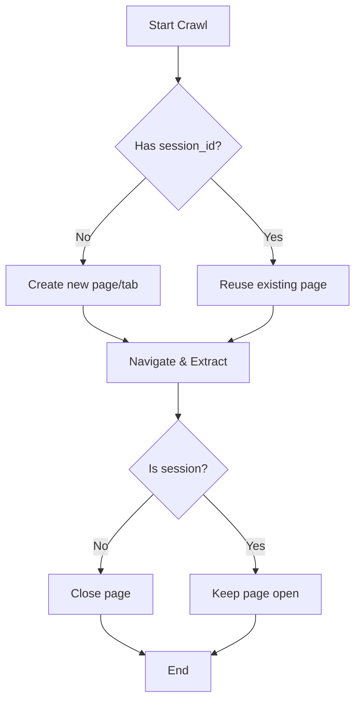

# CDP Browser Crawling

> **New in v0.7.6**: Efficient concurrent crawling with managed CDP (Chrome DevTools Protocol) browsers. Connect to a running browser instance and perform multiple crawls without spawning new windows.

## 1. Overview

When working with CDP browsers, you can connect to an existing browser instance instead of launching a new one for each crawl. This is particularly useful for:

- **Development**: Keep your browser open with DevTools for debugging
- **Persistent Sessions**: Maintain authentication across multiple crawls  
- **Resource Efficiency**: Reuse a single browser instance for multiple operations
- **Concurrent Crawling**: Run multiple crawls simultaneously with proper isolation

**Key Benefits:**

- ✅ Single browser window with multiple tabs (no window clutter)
- ✅ Shared state (cookies, localStorage) across crawls
- ✅ Concurrent safety with automatic page isolation
- ✅ Automatic cleanup to prevent memory leaks
- ✅ Works seamlessly with `arun_many()` for parallel crawling

---

## 2. Quick Start

### 2.1 Starting a CDP Browser

Use the Crawl4AI CLI to start a managed CDP browser:

```bash
# Start CDP browser on default port (9222)
crwl cdp

# Start on custom port
crwl cdp -d 9223

# Start in headless mode
crwl cdp --headless
```

The browser will stay running until you press 'q' or close the terminal.

### 2.2 Basic CDP Connection

```python
import asyncio
from crawl4ai import AsyncWebCrawler, BrowserConfig, CrawlerRunConfig

async def main():
    # Configure CDP connection
    browser_cfg = BrowserConfig(
        browser_type="chromium",
        cdp_url="http://localhost:9222",
        verbose=True
    )
    
    # Crawl a single URL
    async with AsyncWebCrawler(config=browser_cfg) as crawler:
        result = await crawler.arun(
            url="https://example.com",
            config=CrawlerRunConfig()
        )
        print(f"Success: {result.success}")
        print(f"Content length: {len(result.markdown)}")

if __name__ == "__main__":
    asyncio.run(main())
```

---

## 3. Concurrent Crawling with arun_many()

The real power of CDP crawling shines with `arun_many()`. The browser manager automatically handles:

- **Page Isolation**: Each crawl gets its own tab
- **Context Sharing**: All tabs share cookies and localStorage
- **Concurrent Safety**: Proper locking prevents race conditions
- **Auto Cleanup**: Tabs are closed after crawling (except sessions)

### 3.1 Basic Concurrent Crawling

```python
import asyncio
from crawl4ai import AsyncWebCrawler, BrowserConfig, CrawlerRunConfig, CacheMode

async def crawl_multiple_urls():
    # URLs to crawl
    urls = [
        "https://example.com",
        "https://httpbin.org/html",
        "https://www.python.org",
    ]
    
    # Configure CDP browser
    browser_cfg = BrowserConfig(
        browser_type="chromium",
        cdp_url="http://localhost:9222",
        verbose=False
    )
    
    # Configure crawler (bypass cache for fresh data)
    crawler_cfg = CrawlerRunConfig(
        cache_mode=CacheMode.BYPASS
    )
    
    # Crawl all URLs concurrently
    async with AsyncWebCrawler(config=browser_cfg) as crawler:
        results = await crawler.arun_many(
            urls=urls,
            config=crawler_cfg
        )
        
        # Process results
        for result in results:
            print(f"\nURL: {result.url}")
            if result.success:
                print(f"✓ Success | Content length: {len(result.markdown)}")
            else:
                print(f"✗ Failed: {result.error_message}")

if __name__ == "__main__":
    asyncio.run(crawl_multiple_urls())
```

### 3.2 With Session Management

Use sessions to maintain authentication and state across individual crawls:

```python
async def crawl_with_sessions():
    browser_cfg = BrowserConfig(
        browser_type="chromium",
        cdp_url="http://localhost:9222"
    )
    
    async with AsyncWebCrawler(config=browser_cfg) as crawler:
        # First crawl: Login page
        login_result = await crawler.arun(
            url="https://example.com/login",
            config=CrawlerRunConfig(
                session_id="my-session",  # Session persists
                js_code="document.querySelector('#login').click();"
            )
        )
        
        # Second crawl: Reuse authenticated session
        dashboard_result = await crawler.arun(
            url="https://example.com/dashboard",
            config=CrawlerRunConfig(
                session_id="my-session"  # Same session, cookies preserved
            )
        )
```

---

## 4. How It Works

### 4.1 Browser Context Reuse

When using CDP browsers, Crawl4AI:

1. **Connects** to the existing browser via CDP URL
2. **Reuses** the default browser context (single window)
3. **Creates** new pages (tabs) for each crawl
4. **Locks** page creation to prevent concurrent races
5. **Cleans up** pages after crawling (unless it's a session)

```python
# Internal behavior (simplified)
if self.config.use_managed_browser:
    context = self.default_context  # Shared context
    
    # Thread-safe page creation
    async with self._page_lock:
        page = await context.new_page()  # New tab per crawl
    
    # After crawl completes
    if not config.session_id:
        await page.close()  # Auto cleanup
```

### 4.2 Page Lifecycle



### 4.3 State Sharing

All pages in the same context share:

- 🍪 **Cookies**: Authentication tokens, preferences
- 💾 **localStorage**: Client-side data storage
- 🔐 **sessionStorage**: Per-tab session data
- 🌐 **Network cache**: Shared HTTP cache

This makes it perfect for crawling authenticated sites or maintaining state across multiple pages.

---

## 5. Configuration Options

### 5.1 BrowserConfig for CDP

```python
browser_cfg = BrowserConfig(
    browser_type="chromium",           # Must be "chromium" for CDP
    cdp_url="http://localhost:9222",   # CDP endpoint URL
    verbose=True,                      # Log browser operations
    
    # Optional: Override headers for all requests
    headers={
        "Accept-Language": "en-US,en;q=0.9",
    },
    
    # Optional: Set user agent
    user_agent="Mozilla/5.0 ...",
    
    # Optional: Enable stealth mode (requires dedicated browser)
    # enable_stealth=False,  # Not compatible with CDP
)
```

### 5.2 CrawlerRunConfig Options

```python
crawler_cfg = CrawlerRunConfig(
    # Session management
    session_id="my-session",           # Persist page across calls
    
    # Caching
    cache_mode=CacheMode.BYPASS,       # Fresh data every time
    
    # Browser location (affects timezone, locale)
    locale="en-US",
    timezone_id="America/New_York",
    geolocation={
        "latitude": 40.7128,
        "longitude": -74.0060
    },
    
    # Proxy (per-crawl override)
    proxy_config={
        "server": "http://proxy.example.com:8080",
        "username": "user",
        "password": "pass"
    }
)
```

---

## 6. Advanced Patterns

### 6.1 Streaming Results

Process URLs as they complete instead of waiting for all:

```python
async def stream_crawl_results():
    browser_cfg = BrowserConfig(
        browser_type="chromium",
        cdp_url="http://localhost:9222"
    )
    
    urls = ["https://example.com" for _ in range(100)]
    
    async with AsyncWebCrawler(config=browser_cfg) as crawler:
        # Stream results as they complete
        async for result in crawler.arun_many(
            urls=urls,
            config=CrawlerRunConfig(stream=True)
        ):
            if result.success:
                print(f"✓ {result.url}: {len(result.markdown)} chars")
                # Process immediately instead of waiting for all
                await save_to_database(result)
```

### 6.2 Custom Concurrency Control

```python
from crawl4ai import CrawlerRunConfig

# Limit concurrent crawls to 3
crawler_cfg = CrawlerRunConfig(
    semaphore_count=3,      # Max 3 concurrent requests
    mean_delay=0.5,         # Average 0.5s delay between requests
    max_range=1.0,          # +/- 1s random delay
)

async with AsyncWebCrawler(config=browser_cfg) as crawler:
    results = await crawler.arun_many(urls, config=crawler_cfg)
```

### 6.3 Multi-Config Crawling

Different configurations for different URL groups:

```python
from crawl4ai import CrawlerRunConfig

# Fast crawl for static pages
fast_config = CrawlerRunConfig(
    wait_until="domcontentloaded",
    page_timeout=30000
)

# Slow crawl for dynamic pages
slow_config = CrawlerRunConfig(
    wait_until="networkidle",
    page_timeout=60000,
    js_code="window.scrollTo(0, document.body.scrollHeight);"
)

configs = [fast_config, slow_config, fast_config]
urls = ["https://static.com", "https://dynamic.com", "https://static2.com"]

async with AsyncWebCrawler(config=browser_cfg) as crawler:
    results = await crawler.arun_many(urls, configs=configs)
```

---

## 7. Best Practices

### 7.1 Resource Management

✅ **DO:**
```python
# Use context manager for automatic cleanup
async with AsyncWebCrawler(config=browser_cfg) as crawler:
    results = await crawler.arun_many(urls)
# Browser connection closed automatically
```

❌ **DON'T:**
```python
# Manual management risks resource leaks
crawler = AsyncWebCrawler(config=browser_cfg)
await crawler.start()
results = await crawler.arun_many(urls)
# Forgot to call crawler.close()!
```

### 7.2 Session Management

✅ **DO:**
```python
# Use sessions for related crawls
config = CrawlerRunConfig(session_id="user-flow")
await crawler.arun(login_url, config=config)
await crawler.arun(dashboard_url, config=config)
await crawler.kill_session("user-flow")  # Clean up when done
```

❌ **DON'T:**
```python
# Creating new session IDs unnecessarily
for i in range(100):
    config = CrawlerRunConfig(session_id=f"session-{i}")
    await crawler.arun(url, config=config)
# 100 unclosed sessions accumulate!
```

### 7.3 Error Handling

```python
async def robust_crawl(urls):
    browser_cfg = BrowserConfig(
        browser_type="chromium",
        cdp_url="http://localhost:9222"
    )
    
    try:
        async with AsyncWebCrawler(config=browser_cfg) as crawler:
            results = await crawler.arun_many(urls)
            
            # Separate successes and failures
            successes = [r for r in results if r.success]
            failures = [r for r in results if not r.success]
            
            print(f"✓ {len(successes)} succeeded")
            print(f"✗ {len(failures)} failed")
            
            # Retry failures with different config
            if failures:
                retry_urls = [r.url for r in failures]
                retry_config = CrawlerRunConfig(
                    page_timeout=120000,  # Longer timeout
                    wait_until="networkidle"
                )
                retry_results = await crawler.arun_many(
                    retry_urls, 
                    config=retry_config
                )
                
            return successes + retry_results
            
    except Exception as e:
        print(f"Fatal error: {e}")
        return []
```

---

## 8. Troubleshooting

### 8.1 Connection Issues

**Problem**: `Cannot connect to CDP browser`

```python
# Check CDP browser is running
$ lsof -i :9222
# Should show: Chromium  PID USER   FD   TYPE  ...

# Or start it if not running
$ crwl cdp
```

**Problem**: `ERR_ABORTED` errors in concurrent crawls

✅ **Fixed in v0.7.6**: This issue has been resolved. Pages are now properly isolated with locking.

### 8.2 Performance Issues

**Problem**: Too many open tabs

```python
# Ensure you're not using session_id for everything
config = CrawlerRunConfig()  # No session_id
await crawler.arun_many(urls, config=config)
# Pages auto-close after crawling
```

**Problem**: Memory leaks

```python
# Always use context manager
async with AsyncWebCrawler(config=browser_cfg) as crawler:
    # Crawling code here
    pass
# Automatic cleanup on exit
```

### 8.3 State Issues

**Problem**: Cookies not persisting

```python
# Use the same context (automatic with CDP)
browser_cfg = BrowserConfig(cdp_url="http://localhost:9222")
# All crawls share cookies automatically
```

**Problem**: Need isolated state

```python
# Use different CDP endpoints or non-CDP browsers
browser_cfg_1 = BrowserConfig(cdp_url="http://localhost:9222")
browser_cfg_2 = BrowserConfig(cdp_url="http://localhost:9223")
# Completely isolated browsers
```

---

## 9. Comparison: CDP vs Regular Browsers

| Feature | CDP Browser | Regular Browser |
|---------|-------------|-----------------|
| **Window Management** | ✅ Single window, multiple tabs | ❌ New window per context |
| **Startup Time** | ✅ Instant (already running) | ⏱️ ~2-3s per launch |
| **State Sharing** | ✅ Shared cookies/localStorage | ⚠️ Isolated by default |
| **Concurrent Safety** | ✅ Automatic locking | ✅ Separate processes |
| **Memory Usage** | ✅ Lower (shared browser) | ⚠️ Higher (multiple processes) |
| **Session Persistence** | ✅ Native support | ✅ Via session_id |
| **Stealth Mode** | ❌ Not compatible | ✅ Full support |
| **Best For** | Development, authenticated crawls | Production, isolated crawls |

---

## 10. Real-World Examples

### 10.1 E-commerce Product Scraping

```python
async def scrape_products():
    browser_cfg = BrowserConfig(
        browser_type="chromium",
        cdp_url="http://localhost:9222"
    )
    
    # Get product URLs from category page
    async with AsyncWebCrawler(config=browser_cfg) as crawler:
        category_result = await crawler.arun(
            url="https://shop.example.com/category",
            config=CrawlerRunConfig(
                css_selector=".product-link"
            )
        )
        
        # Extract product URLs
        product_urls = extract_urls(category_result.links)
        
        # Crawl all products concurrently
        product_results = await crawler.arun_many(
            urls=product_urls,
            config=CrawlerRunConfig(
                css_selector=".product-details",
                semaphore_count=5  # Polite crawling
            )
        )
        
        return [extract_product_data(r) for r in product_results]
```

### 10.2 News Article Monitoring

```python
import asyncio
from datetime import datetime

async def monitor_news_sites():
    browser_cfg = BrowserConfig(
        browser_type="chromium",
        cdp_url="http://localhost:9222"
    )
    
    news_sites = [
        "https://news.site1.com",
        "https://news.site2.com",
        "https://news.site3.com"
    ]
    
    async with AsyncWebCrawler(config=browser_cfg) as crawler:
        while True:
            print(f"\n[{datetime.now()}] Checking for updates...")
            
            results = await crawler.arun_many(
                urls=news_sites,
                config=CrawlerRunConfig(
                    cache_mode=CacheMode.BYPASS,  # Always fresh
                    css_selector=".article-headline"
                )
            )
            
            for result in results:
                if result.success:
                    headlines = extract_headlines(result)
                    for headline in headlines:
                        if is_new(headline):
                            notify_user(headline)
            
            # Check every 5 minutes
            await asyncio.sleep(300)
```

---

## 11. Summary

CDP browser crawling offers:

- 🚀 **Performance**: Faster startup, lower resource usage
- 🔄 **State Management**: Shared cookies and authentication
- 🎯 **Concurrent Safety**: Automatic page isolation and cleanup
- 💻 **Developer Friendly**: Visual debugging with DevTools

**When to use CDP:**
- Development and debugging
- Authenticated crawling (login required)
- Sequential crawls needing state
- Resource-constrained environments

**When to use regular browsers:**
- Production deployments
- Maximum isolation required  
- Stealth mode needed
- Distributed/cloud crawling

For most use cases, **CDP browsers provide the best balance** of performance, convenience, and safety.
