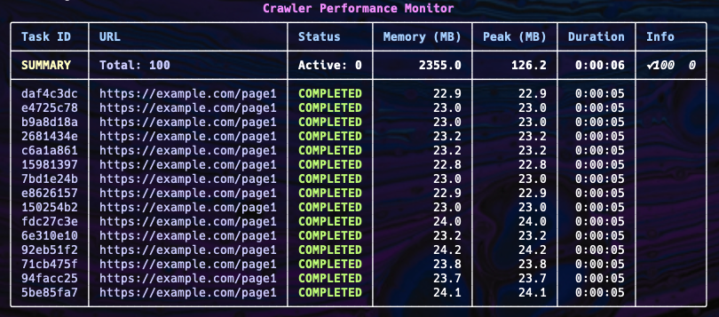

# Crawl Dispatcher

We’re excited to announce a **Crawl Dispatcher** module that can handle **thousands** of crawling tasks simultaneously. By efficiently managing system resources (memory, CPU, network), this dispatcher ensures high-performance data extraction at scale. It also provides **real-time monitoring** of each crawler’s status, memory usage, and overall progress.

Stay tuned—this feature is **coming soon** in an upcoming release of Crawl4AI! For the latest news, keep an eye on our changelogs and follow [@unclecode](https://twitter.com/unclecode) on X.

Below is a **sample** of how the dispatcher’s performance monitor might look in action:

We can’t wait to bring you this streamlined, **scalable** approach to multi-URL crawling—**watch this space** for updates!