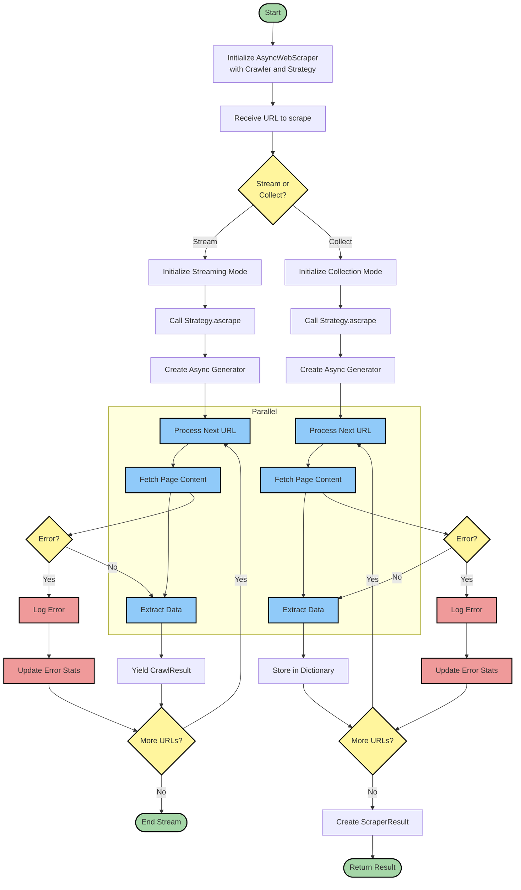

# AsyncWebScraper: Smart Web Crawling Made Easy

AsyncWebScraper is a powerful and flexible web scraping tool that makes it easy to collect data from websites efficiently. Whether you need to scrape a few pages or an entire website, AsyncWebScraper handles the complexity of web crawling while giving you fine-grained control over the process.

## How It Works



AsyncWebScraper uses an intelligent crawling system that can navigate through websites following your specified strategy. It supports two main modes of operation:

### 1. Streaming Mode
```python
async for result in scraper.ascrape(url, stream=True):
    print(f"Found data on {result.url}")
    process_data(result.data)
```
- Perfect for processing large websites
- Memory efficient - handles one page at a time
- Ideal for real-time data processing
- Great for monitoring or continuous scraping tasks

### 2. Collection Mode
```python
result = await scraper.ascrape(url)
print(f"Scraped {len(result.crawled_urls)} pages")
process_all_data(result.extracted_data)
```
- Collects all data before returning
- Best for when you need the complete dataset
- Easier to work with for batch processing
- Includes comprehensive statistics

## Key Features

- **Smart Crawling**: Automatically follows relevant links while avoiding duplicates
- **Parallel Processing**: Scrapes multiple pages simultaneously for better performance
- **Memory Efficient**: Choose between streaming and collecting based on your needs
- **Error Resilient**: Continues working even if some pages fail to load
- **Progress Tracking**: Monitor the scraping progress in real-time
- **Customizable**: Configure crawling strategy, filters, and scoring to match your needs

## Quick Start

```python
from crawl4ai.scraper import AsyncWebScraper, BFSStrategy
from crawl4ai.async_webcrawler import AsyncWebCrawler

# Initialize the scraper
crawler = AsyncWebCrawler()
strategy = BFSStrategy(
    max_depth=2,  # How deep to crawl
    url_pattern="*.example.com/*"  # What URLs to follow
)
scraper = AsyncWebScraper(crawler, strategy)

# Start scraping
async def main():
    # Collect all results
    result = await scraper.ascrape("https://example.com")
    print(f"Found {len(result.extracted_data)} pages")
    
    # Or stream results
    async for page in scraper.ascrape("https://example.com", stream=True):
        print(f"Processing {page.url}")

```

## Best Practices

1. **Choose the Right Mode**
   - Use streaming for large websites or real-time processing
   - Use collecting for smaller sites or when you need the complete dataset

2. **Configure Depth**
   - Start with a small depth (2-3) and increase if needed
   - Higher depths mean exponentially more pages to crawl

3. **Set Appropriate Filters**
   - Use URL patterns to stay within relevant sections
   - Set content type filters to only process useful pages

4. **Handle Resources Responsibly**
   - Enable parallel processing for faster results
   - Consider the target website's capacity
   - Implement appropriate delays between requests

## Common Use Cases

- **Content Aggregation**: Collect articles, blog posts, or news from multiple pages
- **Data Extraction**: Gather product information, prices, or specifications
- **Site Mapping**: Create a complete map of a website's structure
- **Content Monitoring**: Track changes or updates across multiple pages
- **Data Mining**: Extract and analyze patterns across web pages

## Advanced Features

- Custom scoring algorithms for prioritizing important pages
- URL filters for focusing on specific site sections
- Content type filtering for processing only relevant pages
- Progress tracking for monitoring long-running scrapes

Need more help? Check out our [examples repository](https://github.com/example/crawl4ai/examples) or join our [community Discord](https://discord.gg/example).