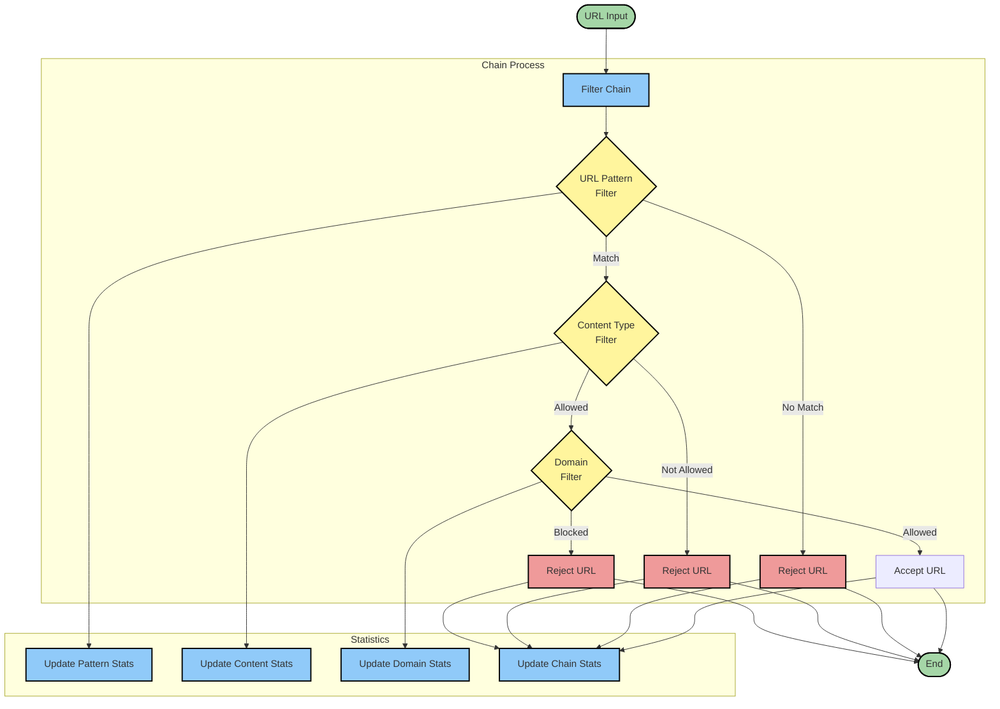
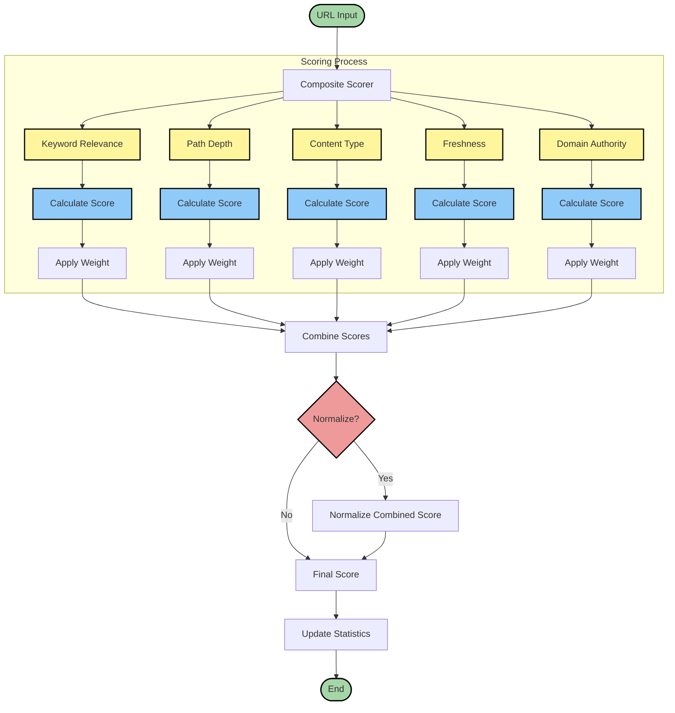

# URL Filters and Scorers

The crawl4ai library provides powerful URL filtering and scoring capabilities that help you control and prioritize your web crawling. This guide explains how to use these features effectively.



## URL Filters

URL filters help you control which URLs are crawled. Multiple filters can be chained together to create sophisticated filtering rules.

### Available Filters

1. **URL Pattern Filter**
```python
pattern_filter = URLPatternFilter([
    "*.example.com/*",  # Glob pattern
    "*/article/*",      # Path pattern
    re.compile(r"blog-\d+") # Regex pattern
])
```
- Supports glob patterns and regex
- Multiple patterns per filter
- Pattern pre-compilation for performance

2. **Content Type Filter**
```python
content_filter = ContentTypeFilter([
    "text/html",
    "application/pdf"
], check_extension=True)
```
- Filter by MIME types
- Extension checking
- Support for multiple content types

3. **Domain Filter**
```python
domain_filter = DomainFilter(
    allowed_domains=["example.com", "blog.example.com"],
    blocked_domains=["ads.example.com"]
)
```
- Allow/block specific domains
- Subdomain support
- Efficient domain matching

### Creating Filter Chains

```python
# Create and configure a filter chain
filter_chain = FilterChain([
    URLPatternFilter(["*.example.com/*"]),
    ContentTypeFilter(["text/html"]),
    DomainFilter(blocked_domains=["ads.*"])
])

# Add more filters
filter_chain.add_filter(
    URLPatternFilter(["*/article/*"])
)
```



## URL Scorers

URL scorers help prioritize which URLs to crawl first. Higher scores indicate higher priority.

### Available Scorers

1. **Keyword Relevance Scorer**
```python
keyword_scorer = KeywordRelevanceScorer(
    keywords=["python", "programming"],
    weight=1.0,
    case_sensitive=False
)
```
- Score based on keyword matches
- Case sensitivity options
- Weighted scoring

2. **Path Depth Scorer**
```python
path_scorer = PathDepthScorer(
    optimal_depth=3,  # Preferred URL depth
    weight=0.7
)
```
- Score based on URL path depth
- Configurable optimal depth
- Diminishing returns for deeper paths

3. **Content Type Scorer**
```python
content_scorer = ContentTypeScorer({
    r'\.html$': 1.0,
    r'\.pdf$': 0.8,
    r'\.xml$': 0.6
})
```
- Score based on file types
- Configurable type weights
- Pattern matching support

4. **Freshness Scorer**
```python
freshness_scorer = FreshnessScorer(weight=0.9)
```
- Score based on date indicators in URLs
- Multiple date format support
- Recency weighting

5. **Domain Authority Scorer**
```python
authority_scorer = DomainAuthorityScorer({
    "python.org": 1.0,
    "github.com": 0.9,
    "medium.com": 0.7
})
```
- Score based on domain importance
- Configurable domain weights
- Default weight for unknown domains

### Combining Scorers

```python
# Create a composite scorer
composite_scorer = CompositeScorer([
    KeywordRelevanceScorer(["python"], weight=1.0),
    PathDepthScorer(optimal_depth=2, weight=0.7),
    FreshnessScorer(weight=0.8)
], normalize=True)
```

## Best Practices

### Filter Configuration

1. **Start Restrictive**
   ```python
   # Begin with strict filters
   filter_chain = FilterChain([
       DomainFilter(allowed_domains=["example.com"]),
       ContentTypeFilter(["text/html"])
   ])
   ```

2. **Layer Filters**
   ```python
   # Add more specific filters
   filter_chain.add_filter(
       URLPatternFilter(["*/article/*", "*/blog/*"])
   )
   ```

3. **Monitor Filter Statistics**
   ```python
   # Check filter performance
   for filter in filter_chain.filters:
       print(f"{filter.name}: {filter.stats.rejected_urls} rejected")
   ```

### Scorer Configuration

1. **Balance Weights**
   ```python
   # Balanced scoring configuration
   scorer = create_balanced_scorer()
   ```

2. **Customize for Content**
   ```python
   # News site configuration
   news_scorer = CompositeScorer([
       KeywordRelevanceScorer(["news", "article"], weight=1.0),
       FreshnessScorer(weight=1.0),
       PathDepthScorer(optimal_depth=2, weight=0.5)
   ])
   ```

3. **Monitor Scoring Statistics**
   ```python
   # Check scoring distribution
   print(f"Average score: {scorer.stats.average_score}")
   print(f"Score range: {scorer.stats.min_score} - {scorer.stats.max_score}")
   ```

## Common Use Cases

### Blog Crawling
```python
blog_config = {
    'filters': FilterChain([
        URLPatternFilter(["*/blog/*", "*/post/*"]),
        ContentTypeFilter(["text/html"])
    ]),
    'scorer': CompositeScorer([
        FreshnessScorer(weight=1.0),
        KeywordRelevanceScorer(["blog", "article"], weight=0.8)
    ])
}
```

### Documentation Sites
```python
docs_config = {
    'filters': FilterChain([
        URLPatternFilter(["*/docs/*", "*/guide/*"]),
        ContentTypeFilter(["text/html", "application/pdf"])
    ]),
    'scorer': CompositeScorer([
        PathDepthScorer(optimal_depth=3, weight=1.0),
        KeywordRelevanceScorer(["guide", "tutorial"], weight=0.9)
    ])
}
```

### E-commerce Sites
```python
ecommerce_config = {
    'filters': FilterChain([
        URLPatternFilter(["*/product/*", "*/category/*"]),
        DomainFilter(blocked_domains=["ads.*", "tracker.*"])
    ]),
    'scorer': CompositeScorer([
        PathDepthScorer(optimal_depth=2, weight=1.0),
        ContentTypeScorer({
            r'/product/': 1.0,
            r'/category/': 0.8
        })
    ])
}
```

## Advanced Topics

### Custom Filters
```python
class CustomFilter(URLFilter):
    def apply(self, url: str) -> bool:
        # Your custom filtering logic
        return True
```

### Custom Scorers
```python
class CustomScorer(URLScorer):
    def _calculate_score(self, url: str) -> float:
        # Your custom scoring logic
        return 1.0
```

For more examples, check our [example repository](https://github.com/example/crawl4ai/examples).