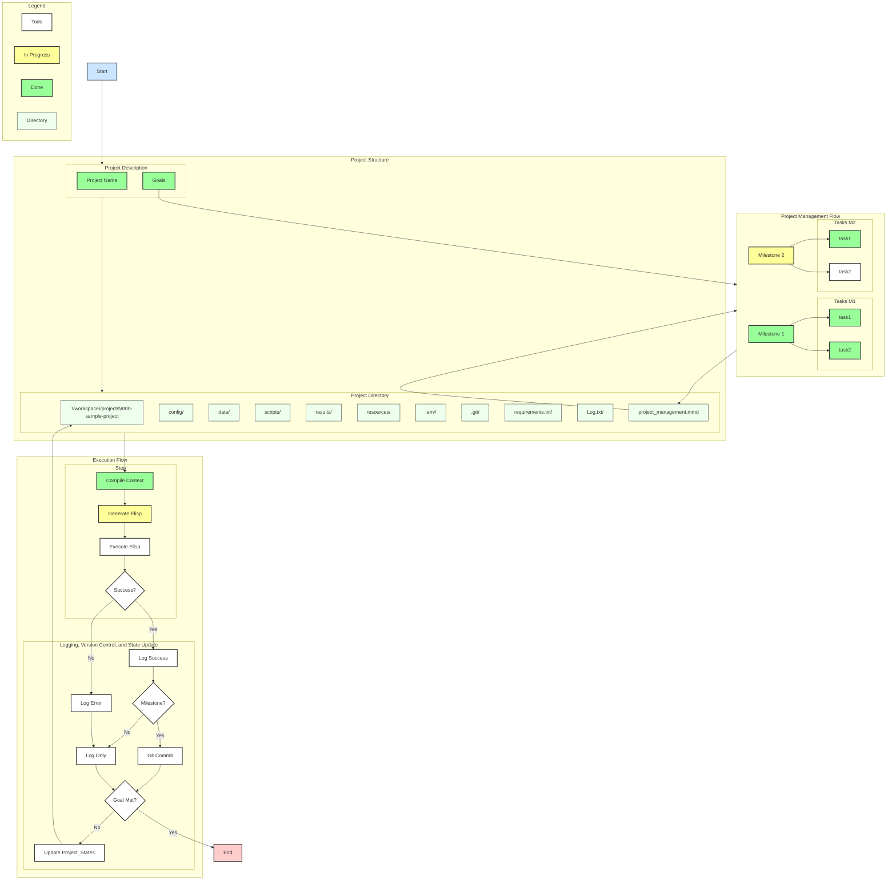

<!-- ---
!-- Timestamp: 2025-05-30 17:10:32
!-- Author: ywatanabe
!-- File: /home/ywatanabe/.dotfiles/.claude/to_claude/guidelines/project/IMPORTANT-project-management-markdown.md
!-- --- -->

Project management is conducted under `./project_management` directory.

## Core Files and Locations
- Original plan: `./project_management/USER_PLAN.md` (DO NOT EDIT)
- Updated plans: `./project_management/CLAUDE_PLAN.md` (Use this as a persistent memory)
- Progress tracking (Markdown): `./project_management/progress-<title>-<timestamp>.md`
- Progress tracking (Mermaid) : `./project_management/progress-<title>-<timestamp>.mmd`
- Memory across sessions: `./project_management/next_steps-<timestamp>.md`

## Progress Format

``` markdown
# Title
| Type | Stat | Description   |
|------|------|---------------|
| 🚀   | [x]  | Project Title |

## Goals, Milestones, and Tasks
#### 🎯 Goal 1: Description
| Type | Stat | Description        |
|------|------|--------------------|
| 🎯   | [ ]  | Goal description   |
|      |      | 📌 Justication     |
|------|------|--------------------|
| 🏁   | [ ]  | Milestone details  |
|      | [J]  | Justication        |
|------|------|--------------------|
| 📋   | [x]  | Completed task     |
|      | [J]  | 📌 `/path/to/file` |

## Key Symbols
| Symbol | Meaning       | Status | Meaning |
|--------|---------------|--------|---------|
| 🎯     | Goal          | [ ]    | TODO    |
| 🏁     | Milestone     | [x]    | DONE    |
| 📋     | Task          |        |         |
| 💡     | Suggestion    |        |         |
| 📌     | Justification |        |         |
```

## Visual Progress Management using Mermaid Diagram
- `./project_management/progress-<title>-<timestamp>.mmd`
  - Mermaid diagram definition file reflecting `./project_management/progress-<title>-<timestamp>.md`
  - Use tags as well
  - Use TD layout
  - Understand the hierarchy and summarize into core elements
  - Summarize up to most-important 7 elements

- `./project_management/progress-<title>-<timestamp>.svg`
  - SVG file created from the mermaid file

- `./project_management/progress-<title>-<timestamp>.gif`
  - GIF image created from the SVG file

#### Rendering Tool
Use `.claude/bin/render_mermaid.sh /path/to/mermaid/file.mmd`

#### Example


## Your Understanding Check
Did you understand the guideline? If yes, please say:
`CLAUDE UNDERSTOOD: <THIS FILE PATH HERE>`

<!-- EOF -->