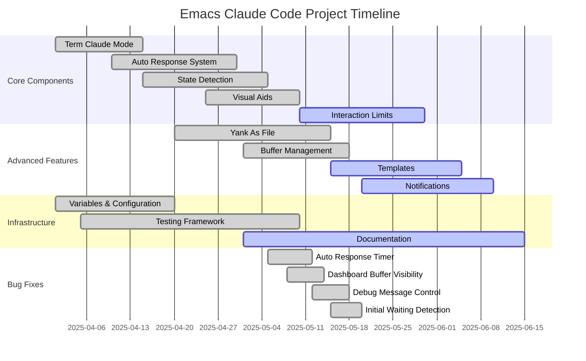

<!-- ---
!-- Timestamp: 2025-06-10 07:13:06
!-- Author: ywatanabe
!-- File: /home/ywatanabe/.dotfiles/.claude/to_claude/guidelines/project/timeline-gantt-chart.md
!-- --- -->

Timeline Gantt charts are excellent tools for planning, directing, and communicating. Therefore, we encourage incorporating this technique into progress management.

Absolute time is not always important; instead, relative time or the visualization of project progression is most important. Therefore, timestamps are not necessarily accurate. You may check git history, but precision is not strictly required.

Embed `git commit hash` to each element. If embedding numbers will clutter output figure, just include comments in mermaid files.

Timeline should be saved as:
    `./project_management/timeline-<timestamp>.mmd`
    `./project_management/timeline-<timestamp>.png`

# Timeline Gantt Chart Format

<!-- EOF -->